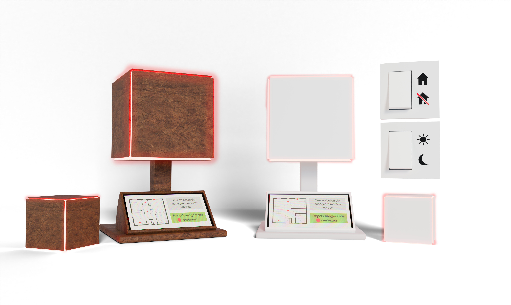

# Ecolux
Ecolux, een slim product dat energieverlies beperkt 

🛠️ Built by ``Viktor Caluwaert``, ``Yenthe Bode`` & ``Vic Syryn``   
🔥 Supervised by ``prof. dr. Bas Baccarne``, ``Yannick Christiaens`` & ``Wouter Devriese``    
🌱 Grown at ``Ghent University`` 🏛️ ``Industrial Design Engineering`` ([project overview](https://github.com/basbaccarne/human-centered-design))       

13/11/2025  

## Samenvatting
Dit project onderzoekt hoe we een slimme en toegankelijke productmaken dat mensen kunnen helpen om thuis energie te besparen. De focus ligt op oplossingen die zowel financiële voordelen bieden voor de gebruiker als een positieve impact hebben op het milieu. Daarbij staat gebruiksgemak centraal: energie besparen moet eenvoudig en haalbaar zijn voor iedereen, zonder ingewikkelde stappen of technische kennis. De mensen die we daarbij willen helpen zijn mensen die renoveren omdat zij hun huis al aan het aanpassen zijn en energiebesparing een belangrijke rol hierin speelt.

Om beter te begrijpen waar mensen tegenaan lopen en wat ze nodig hebben, werd er gewerkt met interviews. Op basis van deze inzichten werd een oplossing ontwikkeld die inspeelt op herkenbare problemen, zoals onduidelijk energieverbruik en verborgen energieverlies in huis.

De uiteindelijke oplossing is de Ecolux: een fysiek product dat energieverlies zichtbaar maakt en duidelijk communiceert. Door informatie op een eenvoudige en begrijpelijke manier te tonen, helpt de Ecolux gebruikers om sneller te zien waar energie verloren gaat en welke acties ze kunnen nemen om dit te verminderen. Hierdoor wordt energie besparen makkelijker én effectiever. 

  

## Introductie

De woningsector speelt een cruciale rol in de huidige energie- en klimaatproblematiek. In Europa is ongeveer 40% van het totale energieverbruik toe te schrijven aan gebouwen, waarvan een groot aandeel afkomstig is van woningen (European Commission, 2023) [^1]. Ondanks technologische vooruitgang en een toenemend aanbod aan slimme energiesystemen, blijft energiebesparing in het dagelijkse leven moeilijk te realiseren. Veel huishoudens beschikken wel over data, maar missen inzicht of motivatie om hun gedrag effectief aan te passen (Thomas & Ritter, 2022) [^2].

De energiecrisis ten gevolge van de oorlog in Oekraïne maakte deze problematiek extra zichtbaar: stijgende energieprijzen dwongen gezinnen om hun verbruik te verminderen, wat resulteerde in een duidelijke gedragsverandering (IEA, 2023) [^3]. Toch bleek deze besparing vaak tijdelijk en sterk afhankelijk van externe druk, wat wijst op een gebrek aan motivatie om te besparen.

Dit project vertrekt vanuit de vaststelling dat bestaande slimme oplossingen voornamelijk inzetten op schermen, apps en numerieke data, wat leidt tot cognitieve belasting en beperkte langetermijnimpact (Norman, 2013) [^4] (Lockton et al., 2010) [^5]. Er is nood aan alternatieve vormen van feedback die energieverbruik op een intuïtieve, laagdrempelige en emotioneel begrijpbare manier zichtbaar maken in het dagelijkse leven.

Het doel van dit project is het verkennen en definiëren van ontwerpprincipes voor een slim, fysiek product dat energieverspilling detecteert en communiceert via eenvoudige visuele en tastbare feedback, zonder voortdurend afhankelijk te zijn van een app. Boundary conditions binnen dit project zijn onder meer minimale technische achtergrond, minimale gebruikersinspanning en het product dient gebruikt te worden binnen een residentiële omgeving.

## Inhoudstafel

1. [Methodologie](./docs/methodologie.md)
2. [Discovery](./docs/discovery.md)
3. [Defintion](./docs/definition.md)
4. [Develop 1](./docs/develop1.md)
5. [Design Requirements](./docs/design_requirements.md)
6. [Bill of materials](./docs/bom.md)

## Kritische reflectie
De discoveryfase gaf een goed beeld van waarom mensen wel willen besparen, maar dit in de praktijk vaak niet lukt. Door bij mensen thuis te observeren en te praten over hun gewoontes, werd duidelijk waar energieverlies ontstaat en waarom dit vaak niet opvalt. Toch waren er maar drie huishoudens onderzocht, waardoor niet alle soorten gebruikers meegenomen zijn (bv. grotere gezinnen, huurders of mensen met andere levensstijlen). Ook kan het zijn dat deelnemers zich anders gedroegen omdat er iemand aanwezig was tijdens het onderzoek, waardoor ze bewuster met energie omgingen dan normaal.

Het benchmarkonderzoek maakte duidelijk dat de meeste bestaande oplossingen vooral werken met cijfers, grafieken en apps. Dit was nuttig om te zien wat al bestaat en wat ontbreekt. Maar het resultaat hangt ook af van welke producten gekozen werden, waardoor sommige alternatieven mogelijk niet in de vergelijking zijn terechtgekomen. Bovendien werd vooral gekeken naar communicatie en feedback, en minder naar zaken zoals installatiegemak, onderhoud of langdurig gebruik.

Hoewel beide waves waardevolle inzichten opleverden over communicatie, functionaliteit en gebruikersverwachtingen, zijn er enkele beperkingen die de interpretatie van de resultaten beïnvloeden. Ten eerste werd gewerkt met quick-and-dirty prototypes, wat geschikt is voor snelle exploratie, maar waardoor bepaalde interacties en reacties mogelijk anders zouden zijn in een realistisch, afgewerkt product. Vooral bij emotie- en vormcommunicatie kan de mate van afwerking de intuïtiviteit sterk beïnvloeden.

In Wave 2 werd vooral gefocust op drie interfaces, maar de vergelijking tussen spraak, tekst en grondplan blijft afhankelijk van hoe goed elke interface uitgewerkt was. Verder was de steekproef beperkt en mogelijk niet representatief voor alle doelgroepen (bv. professioneel vs gezin). Toekomstig onderzoek kan dit opvangen met meer diverse deelnemers en langere veldtesten.
## Noot inzake het gebruik van AI
Voor het herschrijven en taalcorrectie van delen van dit verslag werd gebruikgemaakt van AI.
## Bijlagen
### Discovery
* Interviews (N=3)
  * [Protocol](https://github.com/Vic-Syryn/EcoLux/blob/875a4df8cc1cdf13c941e3fcb967883e65fc3608/reports%20and%20protocols/Contextual_Inquiry_Testing_Protocol.pdf)
  * [Rapport](https://github.com/Vic-Syryn/EcoLux/blob/875a4df8cc1cdf13c941e3fcb967883e65fc3608/reports%20and%20protocols/Contextual_Inquiry_Report.pdf)
* Benchmarkonderzoek (N=10)
  * [Protocol](https://github.com/Vic-Syryn/EcoLux/blob/875a4df8cc1cdf13c941e3fcb967883e65fc3608/reports%20and%20protocols/Benchmarkanalyse_Testing_Protocol.pdf)
  * [Rapport](https://github.com/Vic-Syryn/EcoLux/blob/875a4df8cc1cdf13c941e3fcb967883e65fc3608/reports%20and%20protocols/Benchmarkanalyse_Report.pdf)
    
### Definition
* User testing wave 1 (N=3)
  * [Protocol](https://github.com/Vic-Syryn/EcoLux/blob/94d3a5f92b4216017caaa046f698b3564b813192/reports%20and%20protocols/Ecolux_Protocol_Gebruikerstesten_Wave_1.pdf)
  * [Rapport](https://github.com/Vic-Syryn/EcoLux/blob/94d3a5f92b4216017caaa046f698b3564b813192/reports%20and%20protocols/Ecolux_Report_Gebruikerstesten_Wave_1.pdf)
* User testing wave 2 (N=3)
  * [Protocol](https://github.com/Vic-Syryn/EcoLux/blob/main/reports%20and%20protocols/Ecolux_Protocol_Gebruikerstesten_Wave_2%20(1).pdf)
  * [Rapport](https://github.com/Vic-Syryn/EcoLux/blob/main/reports%20and%20protocols/Ecolux_Report_Gebruikerstesten_Wave_2%20(2).pdf)

### Develop
* User testing fase 1 (N=5)

## Licentie
 

This repository contains both software and design materials created as part of an industrial design energineering project at Ghent University.

- **Software and code:** [MIT License](./LICENSE-MIT)  
- **Design, documentation, CAD, and media:** [CC BY 4.0 License](./LICENSE)
  
You are free to reuse and build upon this work, both commercially and non-commercially, as long as proper attribution is given to the original authors.

## Bronnen
> [^x]: Thomas, T., & Ritter, A. (2022). Wandering & sundowning in dementia. _Practical Neurology, 21_(3), 36–44.

[^1]: European Commission. (2023). Energy efficiency in buildings.
https://energy.ec.europa.eu/topics/energy-efficiency/energy-efficient-buildings_en

[^2]: International Energy Agency. (2023). Energy saving behaviour in response to the energy crisis.
https://www.iea.org/reports/energy-saving-behaviour-in-response-to-the-energy-crisis

[^3]: Lockton, D., Harrison, D., & Stanton, N. A. (2010). The design with intent method: A design tool for influencing user behaviour. Applied Ergonomics, 41(3), 382–392.
https://doi.org/10.1016/j.apergo.2009.09.001

[^4]: Norman, D. A. (2013). The design of everyday things (Revised and expanded ed.). Basic Books.

[^5]: Thomas, V., & Ritter, S. (2022). Behavioural barriers to household energy efficiency: A systematic review. Energy Research & Social Science, 84, 102387.
https://doi.org/10.1016/j.erss.2021.102387