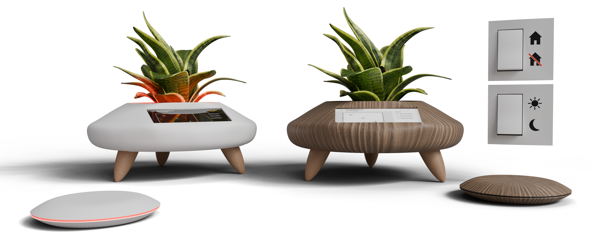

# Ecolux
Ecolux, een slim product dat energieverlies beperkt 

🛠️ Built by ``Viktor Caluwaert``, ``Yenthe Bode`` & ``Vic Syryn``   
🔥 Supervised by ``prof. dr. Bas Baccarne``, ``Yannick Christiaens`` & ``Wouter Devriese``    
🌱 Grown at ``Ghent University`` 🏛️ ``Industrial Design Engineering`` ([project overview](https://github.com/basbaccarne/human-centered-design))       

13/11/2025  

## Samenvatting
EcoLux is een slim energiefeedbacksysteem dat bewuste gezinnen helpt om verborgen energieverlies in huis sneller op te merken en er eenvoudiger op te reageren. Uit het gebruikersonderzoek blijkt dat het zelfden is dat iedereen in het gezin betrokken is bij energie besparen, dat sluipverbruik vaak onbewust blijft aan staan en dat bestaande slimme oplossingen vaak te technisch, app-gericht of datagedreven aanvoelen. EcoLux wil daarom energieverlies zichtbaar maken op een laagdrempelige, passieve en begrijpelijke manier.

Het project evolueerde van een algemeen concept rond energiezuinig renoveren naar een concreet fysiek product voor energie bewuste gezinnen: een subtiele slimme bloempot die als hoofdstation in het interieur staat. Het systeem combineert een geïntegreerd touchscreen, een visuele plattegrondinterface, lichtfeedback en slimme koppelingen met toestellen in huis. Wanneer een toestel energie verspilt, toont EcoLux duidelijk in welke ruimte het energieverlies zich bevindt en kan de gebruiker snel ingrijpen of het toestel laten uitschakelen. De instellingen van de gebruiker bepalen wanneer de EcoLux een toestel als energieverspiller beschouwt.

Door iteratieve gebruikerstesten werd het ontwerp stap voor stap verfijnd. 

Met EcoLux willen we gezinnen helpen om energieverspilling te verminderen zonder extra complexiteit toe te voegen aan hun dagelijkse routines. Het product maakt onzichtbaar energieverlies zichtbaar, verlaagt de drempel tot actie en ondersteunt bewuster energiegedrag met behoud van comfort en controle. 

  

render EcoLux

## Introductie

De woningsector speelt een cruciale rol in de huidige energie- en klimaatproblematiek. In Europa is ongeveer 40% van het totale energieverbruik toe te schrijven aan gebouwen, waarvan een groot aandeel afkomstig is van woningen (European Commission, 2023) [^1]. Ondanks technologische vooruitgang en een toenemend aanbod aan slimme energiesystemen, blijft energiebesparing in het dagelijkse leven moeilijk te realiseren. Veel huishoudens beschikken wel over data, maar missen inzicht of motivatie om hun gedrag effectief aan te passen (Thomas & Ritter, 2022) [^2].

De energiecrisis ten gevolge van de oorlog in Oekraïne maakte deze problematiek extra zichtbaar: stijgende energieprijzen dwongen gezinnen om hun verbruik te verminderen, wat resulteerde in een duidelijke gedragsverandering (IEA, 2023) [^3]. Toch bleek deze besparing vaak tijdelijk en sterk afhankelijk van externe druk, wat wijst op een gebrek aan motivatie om te besparen.

Dit project vertrekt vanuit de vaststelling dat bestaande slimme oplossingen voornamelijk inzetten op schermen, apps en numerieke data, wat leidt tot cognitieve belasting en beperkte langetermijnimpact (Norman, 2013) [^4] (Lockton et al., 2010) [^5]. Er is nood aan alternatieve vormen van feedback die energieverbruik op een intuïtieve, laagdrempelige en emotioneel begrijpbare manier zichtbaar maken in het dagelijkse leven.

Het doel van dit project is het verkennen en definiëren van ontwerpprincipes voor een slim, fysiek product dat energieverspilling detecteert en communiceert via eenvoudige visuele en tastbare feedback, zonder voortdurend afhankelijk te zijn van een app. Boundary conditions binnen dit project zijn onder meer minimale technische achtergrond, minimale gebruikersinspanning en het product dient gebruikt te worden binnen een residentiële omgeving.

## Inhoudstafel

1. [Methodologie](./docs/methodologie.md)
2. [Discovery](./docs/discovery.md)
3. [Defintion](./docs/definition.md)
4. [Develop 1](./docs/develop1.md)
5. [Develop 2](./docs/develop2.md)
6. [Develop 3](./docs/develop3.md)
7. [Develop 4](./docs/develop4.md)
8. [Conclusie](./docs/conclusie.md)
8. [Design Requirements](./docs/design_requirements.md)
9. [Bill of materials](./docs/bom.md)

## Kritische reflectie
De discoveryfase gaf een goed beeld van waarom mensen wel willen besparen, maar dit in de praktijk vaak niet lukt. Door bij mensen thuis te observeren en te praten over hun gewoontes, werd duidelijk waar energieverlies ontstaat en waarom dit vaak niet opvalt. Toch waren er maar drie huishoudens onderzocht, waardoor niet alle soorten gebruikers meegenomen zijn (bv. grotere gezinnen, huurders of mensen met andere levensstijlen). Ook kan het zijn dat deelnemers zich anders gedroegen omdat er iemand aanwezig was tijdens het onderzoek, waardoor ze bewuster met energie omgingen dan normaal.

Het benchmarkonderzoek maakte duidelijk dat de meeste bestaande oplossingen vooral werken met cijfers, grafieken en apps. Dit was nuttig om te zien wat al bestaat en wat ontbreekt. Maar het resultaat hangt ook af van welke producten gekozen werden, waardoor sommige alternatieven mogelijk niet in de vergelijking zijn terechtgekomen. Bovendien werd in deze fase vooral gekeken naar communicatie en feedback, en minder naar zaken zoals installatiegemak, onderhoud of langdurig gebruik.
De definition fase werd opgedeeld in 2 waves. Hoewel beide waves waardevolle inzichten opleverden over communicatie, functionaliteit en gebruikersverwachtingen, zijn er enkele beperkingen die de interpretatie van de resultaten beïnvloeden. 
Bij Wave 1 werd gewerkt met quick-and-dirty prototypes, wat geschikt is voor snelle exploratie, maar waardoor bepaalde interacties en reacties mogelijk anders zouden zijn in een realistisch, afgewerkt product. Vooral bij emotie- en vormcommunicatie kan de mate van afwerking de intuïtiviteit sterk beïnvloeden.

In Wave 2 werd vooral gefocust op drie interfaces, maar de vergelijking tussen spraak, tekst en grondplan blijft afhankelijk van hoe goed elke interface uitgewerkt was. Verder was de steekproef beperkt en mogelijk niet representatief voor alle doelgroepen (bv. professioneel vs gezin).
De develop fase werd opgedeeld in 3 fases.
De Develop 1-fase hielp om het concept verder te concretiseren via een aangepaste doelgroep en een conceptkeuze met behulp van een scorematrix. Hoewel dit structuur gaf aan het ontwerpproces, bleven sommige keuzes deels gebaseerd op aannames, zoals de interpretatie van de bloempot als ecologische metafoor. De analyse-tools maakten de interacties binnen het systeem duidelijker, maar toonden ook dat bepaalde aspecten, zoals de communicatie van energieverliezen, nog onvoldoende uitgewerkt waren. De gebruikerstesten brachten belangrijke problemen rond interactie, stabiliteit en ergonomie aan het licht, wat uiteindelijk leidde tot het loslaten van het mechanisch complexe uitschuifbare scherm ten gunste van een eenvoudiger ontwerp.

De Develop 2-fase maakte het mogelijk om het concept verder te verfijnen op vlak van ergonomie, vormgeving en interactie. Door gebruik te maken van ergonomische simulaties in Siemens Jack en fysieke prototypes werd duidelijk welke schermhoek, schermgrootte en vorm het meest comfortabel en gebruiksvriendelijk waren. Toch blijven er ook enkele beperkingen binnen deze fase. Zo werd gewerkt met relatief eenvoudige schuimmodellen en gerenderde visualisaties, waardoor aspecten zoals materiaalgevoel, gewicht en afwerkingskwaliteit nog niet realistisch konden worden ervaren. Hierdoor kunnen bepaalde reacties op esthetiek of gebruiksgemak verschillen van hoe gebruikers een finaal product zouden beoordelen. Daarnaast waren de gebruikerstesten gebaseerd op een beperkte steekproef van vijf respondenten, waardoor voorkeuren rond vorm en interface niet noodzakelijk representatief zijn voor alle gebruikers. Ook de validatie van de ergonomie gebeurde voornamelijk in statische situaties en hield minder rekening met langdurig gebruik of verschillende gebruikscontexten binnen de woning. Verder bleef de interface vooral gericht op begrijpelijkheid en visuele eenvoud, terwijl aspecten zoals toegankelijkheid voor personen met beperkingen minder uitgebreid onderzocht werden. De geschatte besparing van ongeveer €100 per jaar geeft een nuttige indicatie van de mogelijke financiële meerwaarde, maar blijft gebaseerd op aannames rond gebruik, energieprijzen, sluipverbruik en het aantal gekoppelde toestellen. Daarom mag deze waarde niet als gegarandeerde besparing worden voorgesteld. De besparing moet voorzichtig wordt geformuleerd als een realistische schatting die in de praktijk verder gevalideerd moet worden.

De Develop 3-fase bood waardevolle inzichten in de emotionele beleving, servicecontext en CMF-keuzes van EcoLux. Door gebruikers niet alleen te laten reageren op functionaliteit, maar ook op uitstraling, materialen en integratie binnen het interieur, werd duidelijk hoe belangrijk vertrouwen, rust en subtiliteit zijn binnen het concept. Toch kent ook deze fase enkele beperkingen. De evaluatie van kleuren, materialen en afwerkingen gebeurde hoofdzakelijk aan de hand van renders en touch-and-feel borden, waardoor de ervaring van een echt afgewerkt product nog ontbrak. Factoren zoals slijtage, onderhoud, lichtinval of langdurige perceptie konden hierdoor niet getest worden. Daarnaast focuste het service design vooral op hypothetische scenario’s en verwachte gebruikerservaringen, zonder langdurige praktijkvalidatie van het volledige ecosysteem. Ook hier bleef het aantal deelnemers beperkt, waardoor culturele voorkeuren, verschillen in wooncontext of technologische ervaring mogelijk onvoldoende vertegenwoordigd zijn. Tot slot werd vooral gekeken naar de gewenste emotionele uitstraling van het product, terwijl de impact van langdurige notificaties, automatisatie of gedragsverandering op lange termijn nog onvoldoende onderzocht werd.

Develop 4 was een belangrijke fase omdat EcoLux hier technisch werd gevalideerd. Het prototype toont aan dat de kernonderdelen kunnen samenwerken: het aanraakscherm, de software op de Raspberry Pi, de Matter-koppeling met slimme apparaten en de Arduino met LED-feedback. Een sterk punt van deze fase is dat de digitale en fysieke feedback samenkomen in één werkend systeem. Dit ondersteunt het centrale idee van EcoLux: verborgen energieverlies zichtbaar maken op een eenvoudige en laagdrempelige manier. Ook de keuze voor Matter is logisch, omdat dit EcoLux toekomstgerichter en compatibeler maakt met verschillende smart-homeapparaten. Toch blijft deze fase vooral een proof of concept. De werking werd technisch aangetoond, maar nog niet uitgebreid getest in een echte wooncontext of over een langere periode. Vooral betrouwbaarheid, foutafhandeling, langdurig gebruik en de integratie van de hardware in het product is beperkt onderzocht. Deze fase bevestigt dus de technische haalbaarheid van EcoLux, maar toont ook dat verdere verfijning nodig is voordat het systeem als volledig afgewerkt product kan worden beschouwd.

## Noot inzake het gebruik van AI
Voor het herschrijven van delen van dit verslag, het behalen van het juiste aantal woorden en het uitvoeren van taalcorrecties werd gebruikgemaakt van AI.
## Bijlagen
### Discovery
* Interviews (N=3)
  * [Protocol](https://github.com/Vic-Syryn/EcoLux/blob/875a4df8cc1cdf13c941e3fcb967883e65fc3608/reports%20and%20protocols/Contextual_Inquiry_Testing_Protocol.pdf)
  * [Rapport](https://github.com/Vic-Syryn/EcoLux/blob/875a4df8cc1cdf13c941e3fcb967883e65fc3608/reports%20and%20protocols/Contextual_Inquiry_Report.pdf)
* Benchmarkonderzoek (N=10)
  * [Protocol](https://github.com/Vic-Syryn/EcoLux/blob/875a4df8cc1cdf13c941e3fcb967883e65fc3608/reports%20and%20protocols/Benchmarkanalyse_Testing_Protocol.pdf)
  * [Rapport](https://github.com/Vic-Syryn/EcoLux/blob/875a4df8cc1cdf13c941e3fcb967883e65fc3608/reports%20and%20protocols/Benchmarkanalyse_Report.pdf)
    
### Definition
* User testing wave 1 (N=3)
  * [Protocol](https://github.com/Vic-Syryn/EcoLux/blob/94d3a5f92b4216017caaa046f698b3564b813192/reports%20and%20protocols/Ecolux_Protocol_Gebruikerstesten_Wave_1.pdf)
  * [Rapport](https://github.com/Vic-Syryn/EcoLux/blob/94d3a5f92b4216017caaa046f698b3564b813192/reports%20and%20protocols/Ecolux_Report_Gebruikerstesten_Wave_1.pdf)
* User testing wave 2 (N=3)
  * [Protocol](https://github.com/Vic-Syryn/EcoLux/blob/main/reports%20and%20protocols/Ecolux_Protocol_Gebruikerstesten_Wave_2%20(1).pdf)
  * [Rapport](https://github.com/Vic-Syryn/EcoLux/blob/main/reports%20and%20protocols/Ecolux_Report_Gebruikerstesten_Wave_2%20(2).pdf)

### Develop
* User testing fase 1 (N=5)
  * [Protocol](https://github.com/Vic-Syryn/EcoLux/blob/main/reports%20and%20protocols/EcoLux_Protocol_Gebruikerstesten_Develop_1_EcoLux.pdf)
  * [Rapport](https://github.com/Vic-Syryn/EcoLux/blob/main/reports%20and%20protocols/EcoLux_Report_Gebruikerstesten_Develop_1_EcoLux.pdf)
* User testing fase 2 (N=5)
  * [Protocol](https://github.com/Vic-Syryn/EcoLux/blob/main/reports%20and%20protocols/Ecolux_Gebruikerstesten_Develop2_Protocol.pdf)
  * [Rapport](https://github.com/Vic-Syryn/EcoLux/blob/main/reports%20and%20protocols/EcoLux_Gebruikerstesten_Develop2_Report.pdf)
* User testing fase 3 (N=4)
  * [Protocol](https://github.com/Vic-Syryn/EcoLux/blob/main/reports%20and%20protocols/Ecolux_Gebruikerstesten_Develop3_Protocol.pdf)
  * [Rapport](https://github.com/Vic-Syryn/EcoLux/blob/main/reports%20and%20protocols/Ecolux_Gebruikerstesten_Develop3_Report.pdf)

## Licentie
 

This repository contains both software and design materials created as part of an industrial design energineering project at Ghent University.

- **Software and code:** [MIT License](./LICENSE-MIT)  
- **Design, documentation, CAD, and media:** [CC BY 4.0 License](./LICENSE)
  
You are free to reuse and build upon this work, both commercially and non-commercially, as long as proper attribution is given to the original authors.

## Bronnen
> [^x]: Thomas, T., & Ritter, A. (2022). Wandering & sundowning in dementia. _Practical Neurology, 21_(3), 36–44.

[^1]: European Commission. (2023). Energy efficiency in buildings.
https://energy.ec.europa.eu/topics/energy-efficiency/energy-efficient-buildings_en

[^2]: International Energy Agency. (2023). Energy saving behaviour in response to the energy crisis.
https://www.iea.org/reports/energy-saving-behaviour-in-response-to-the-energy-crisis

[^3]: Lockton, D., Harrison, D., & Stanton, N. A. (2010). The design with intent method: A design tool for influencing user behaviour. Applied Ergonomics, 41(3), 382–392.
https://doi.org/10.1016/j.apergo.2009.09.001

[^4]: Norman, D. A. (2013). The design of everyday things (Revised and expanded ed.). Basic Books.

[^5]: Thomas, V., & Ritter, S. (2022). Behavioural barriers to household energy efficiency: A systematic review. Energy Research & Social Science, 84, 102387.
https://doi.org/10.1016/j.erss.2021.102387