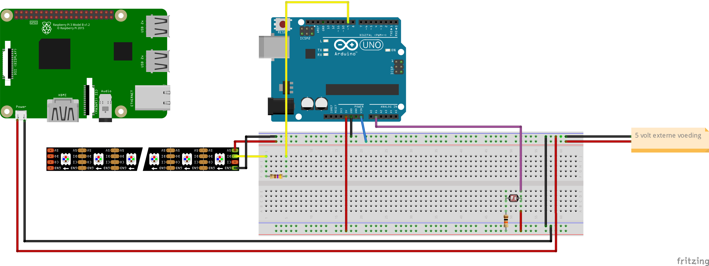
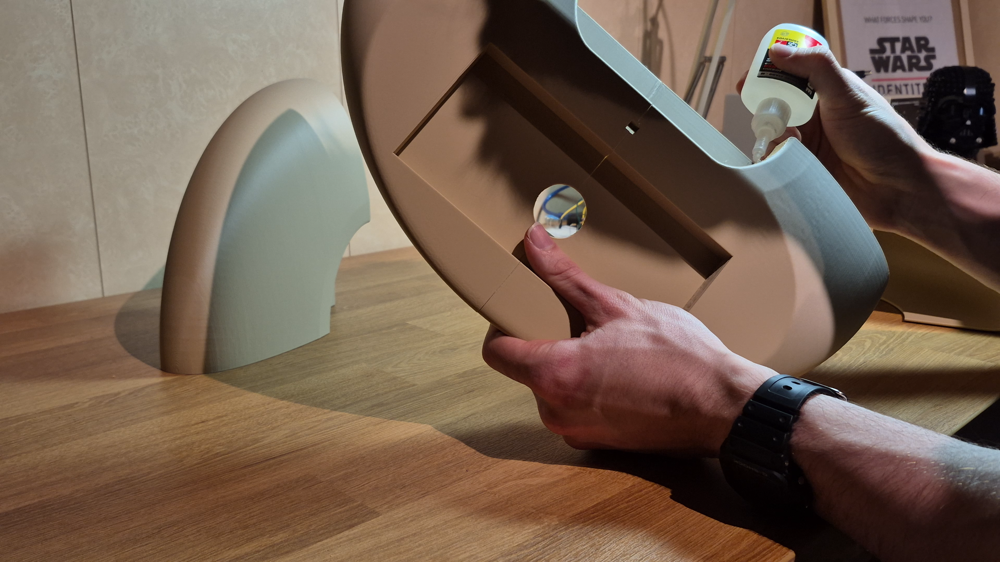
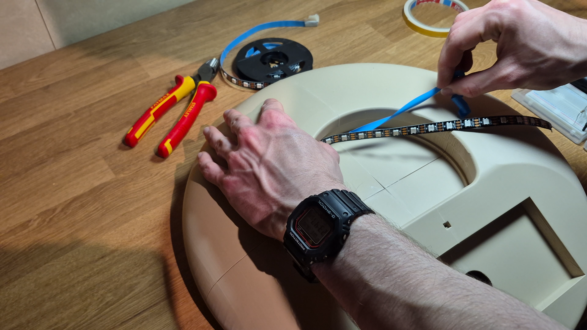
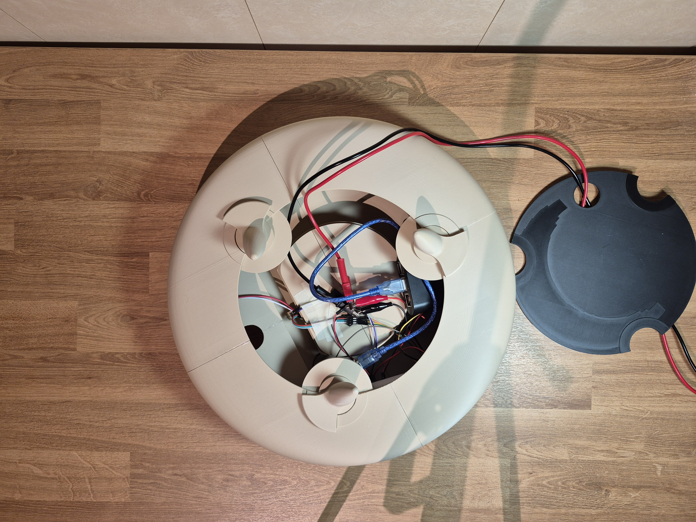
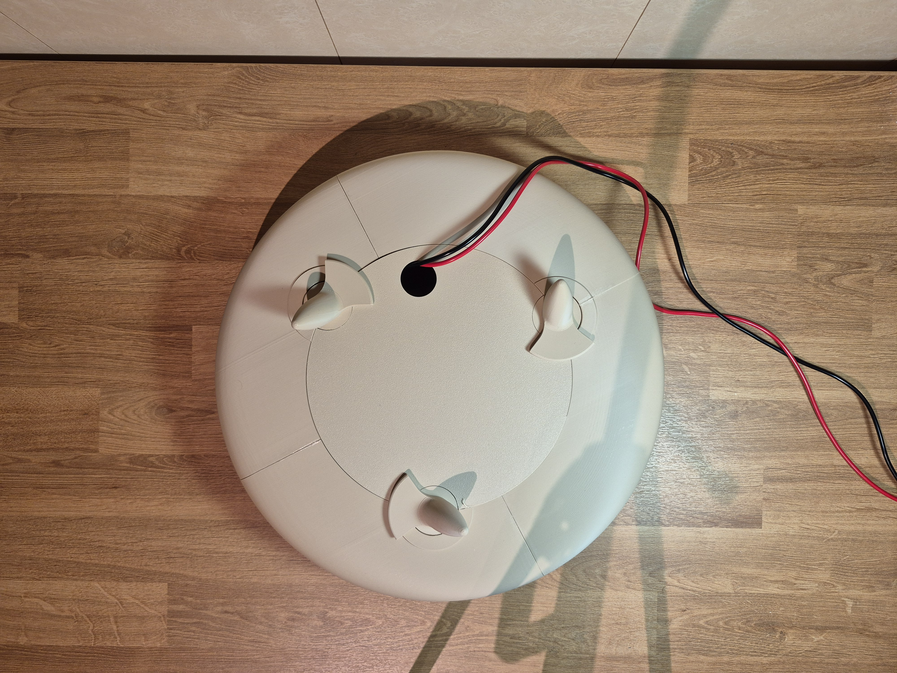
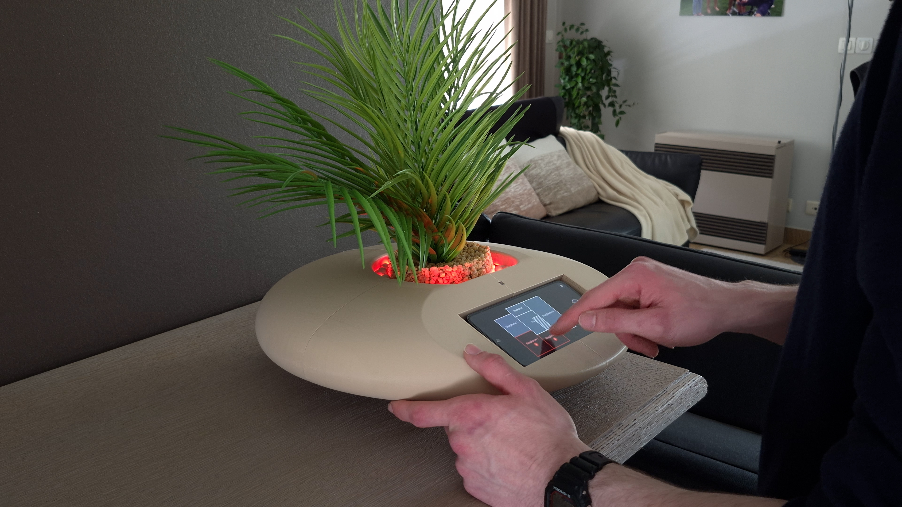

# Bill of materials
begin define fase:
* karton
* magneettape
* ductape
* lijm
* papiertape

eind define fase:
* ledstrip
* touch screen scherm
* hout
* PLA
* Rasberry Pi
* Arduino Uno
* LDR lichtsensor
* smartplug
* smartswitch

# Assembly

## <ins/> Deel 1: Elektronica
## Stap  1: Circuit bouwen
<ins/>Benodigdheden:

- Raspberry Pi (3B+) met Raspberry PI OS
- Arduino Uno
- LDR (lichtsensor)
- WS2812 LED strip (27 LED's, 5V)
- 10kΩ weerstand (voor LDR voltage divider)
- 470Ω weerstand (op data-lijn LED strip)
- USB-A naar USB-B kabel (Pi naar Arduino)
- 5V voeding (minimaal 2A voor Pi + Arduino, strip apart of via Pi bij 27 LED's)
- Jumper wires

Bouw het circuit volgens het onderstaande schema.

<p align="center">
  
  Bevestigen ledstrip
<p align="center">

<p align="center">
  
  Component overview
<p align="center">

## Stap  2: Arduino sketch flashen
1. Open de Arduino IDE op je computer
2. Installeer de **Adafruit NeoPixel** library:
   - Sketch → Include Library → Manage Libraries
   - Zoek "Adafruit NeoPixel" → Install
3. Open `arduino_sketch.ino` Deze file is te vinden in [Hardware](https://github.com/Vic-Syryn/EcoLux/tree/main/src/Hardware)
4. Pas indien nodig de kalibratie aan:
```cpp
   const int LDR_DARK   = 822;  // ADC waarde bij volledig afgedekte LDR
   const int LDR_BRIGHT = 972;  // ADC waarde bij directe lamp op LDR
```
5. Selecteer het juiste board: **Tools → Board → Arduino Uno**
6. Selecteer de juiste poort: **Tools → Port**
7. Klik **Upload**

## Stap 3: Raspberry pi
### 1:
SSH naar de Pi of open een terminal:
 
```bash
# Update het systeem
sudo apt update && sudo apt upgrade -y
 
# Installeer Python dependencies
pip3 install pyserial requests --break-system-packages
```
 
---
### 2:
#### Node.js installeren op de Pi
 
```bash
curl -fsSL https://deb.nodesource.com/setup_18.x | sudo -E bash -
sudo apt install -y nodejs
```
 
#### App bouwen op je computer
 
1. Kopieer de frontend broncode naar je Windows/Mac computer. Deze is te vinden in [Matter-App-Full](https://github.com/Vic-Syryn/EcoLux/tree/main/src/ui/matter-app-full)
2. Open een terminal in de frontend map en voer uit:
```bash
npm install
npm run build
```
3. Kopieer de gegenereerde `dist` map via WinSCP naar de Pi:
```
Doel: /home/ecolux/frontend/dist
```

#### App serveren met Nginx
 
```bash
# Installeer Nginx
sudo apt install nginx -y
 
# Maak een configuratiebestand aan
sudo nano /etc/nginx/sites-available/ecolux
```
 
Plak dit erin:
```nginx
server {
    listen 80;
    root /home/ecolux/frontend/dist;
    index index.html;
    location / { try_files $uri $uri/ /index.html; }
    location /api/ { proxy_pass http://localhost:8000/; }
}
```
 
```bash
# Activeer de configuratie
sudo ln -s /etc/nginx/sites-available/ecolux /etc/nginx/sites-enabled/
sudo rm /etc/nginx/sites-enabled/default
sudo nginx -t
sudo systemctl restart nginx
sudo systemctl enable nginx
```
 
Open de app in de browser: `http://<pi-ip>/`
 
---
### 3:
 
Kopieer via WinSCP of `scp` de volgende bestanden (te vinden in  naar [Hardware](https://github.com/Vic-Syryn/EcoLux/tree/main/src/Hardware)) `/home/ecolux/`:
 
| Bestand | Doel |
|---|---|
| `gpio_controller.py` | `/home/ecolux/gpio_controller.py` |
| `test_components.py` | `/home/ecolux/test_components.py` |
 
En naar `/home/ecolux/matter-api/`:
 
| Bestand | Doel |
|---|---|
| `main.py` | `/home/ecolux/matter-api/main.py` |
 
---
 
### 4: 
 
```bash
# Ga naar de matter-api map
cd /home/ecolux/matter-api
 
# Installeer dependencies in de virtual environment
/home/ecolux/matter-env/bin/pip install fastapi uvicorn websockets pydantic
 
# Test of de API werkt
/home/ecolux/matter-env/bin/uvicorn main:app --host 0.0.0.0 --port 8000
```
 
Open in browser: `http://<pi-ip>:8000/health` — moet `{"status":"ok"}` tonen.
 
Stop de test server met `Ctrl+C`.
 
---
 
### 5:
 
#### Matter API service
 
```bash
sudo nano /etc/systemd/system/matter-api.service
```
 
Plak dit erin:
 
```ini
[Unit]
Description=EcoLux Matter API
After=network.target
 
[Service]
Type=simple
User=ecolux
WorkingDirectory=/home/ecolux/matter-api
ExecStart=/home/ecolux/matter-env/bin/uvicorn main:app --host 0.0.0.0 --port 8000
Restart=on-failure
RestartSec=5
StandardOutput=journal
StandardError=journal
 
[Install]
WantedBy=multi-user.target
```
 
#### GPIO Controller service
 
```bash
sudo nano /etc/systemd/system/ecolux-gpio.service
```
 
Plak dit erin:
 
```ini
[Unit]
Description=EcoLux GPIO / Arduino Controller
After=network.target
 
[Service]
Type=simple
User=ecolux
WorkingDirectory=/home/ecolux
ExecStart=/usr/bin/python3 /home/ecolux/gpio_controller.py
Restart=on-failure
RestartSec=5
StandardOutput=journal
StandardError=journal
 
[Install]
WantedBy=multi-user.target
```
 
#### Beide services activeren
 
```bash
sudo systemctl daemon-reload
sudo systemctl enable matter-api
sudo systemctl enable ecolux-gpio
sudo systemctl start matter-api
sudo systemctl start ecolux-gpio
```
 
---
## <ins/> Deel 2: behuizing
## Stap  1: Onderdelen printen
Print de onderdelen van de plantenpot. De step files en 3mf met onderstaande print opstelling zijn te vinden in [CAD](https://github.com/Vic-Syryn/EcoLux/tree/main/cad). Wegens de omvang en vorm van het hoofdframe, wordt het aangeraden om dit op te splitsen in 4 delen. Naast het hoofdframe moeten er ook 3 pootjes en 1 onderkant geprint worden. Het wordt aanbevolen om deze met 15% infill, tree supports en een brim te printen.

<p align="center">
  
  Print overview
<p align="center">

## Stap 2: Delen hoofdframe aan elkaar lijmen
Lijm de 4 delen van het frame aan elkaar. Secondenlijm wordt hiervoor aangeraden.
<p align="center">
  
  Lijmen
<p align="center">

## Stap 3: Led strip en LDR bevestigen
Bevestig de led strip in de voorziene groef en steek de LDR in in het voorziene gat.
<p align="center">
  
  Bevestigen ledstrip
<p align="center">

### Stap 4: Pootjes en elektronica
Bevestig de pootjes op het hoofdframe, leg de elektronica op de onderkant, met de stroomkabels door het gat. Zorg er vervolgens voor dat de onderkant op de goede plaats zit en verdraai de pootjes zodat de onderkant vastzit aan het hoofdframe.
<p align="center">
  
  Bevestiging pootjes
<p align="center">

<p align="center">
  
  Onderkant afgesloten
<p align="center">

### Eindresultaat
<p align="center">
  
  Ecolux
<p align="center">