## Definition
### <ins>**Wave 1: Communicatie vorm exploratie**</ins>  
**Doestellingen**  
In de eerste Wave werd onderzocht hoe het probleem initieel kan worden gecommuniceerd, met een focus op de functionaliteit. Daarnaast werd bepaald hoe het energieverlies gecommuniceerd moest worden. Dit gebeurde aan de hand van gebruikerstesten en interviews. Hierbij werden de volgende deelvragen beantwoord:  

   * Hoe communiceren we het best het energieverlies bij de gebruiker(awareness)?   
   * Hoe zou de gebruiker willen dat het product wordt geinstalleerd?  
   * Wat is voor de gebruiker de belangrijkste feauture waarom de gebruiker het zou kopen?  
   * Is een of meerdere substations noodzakelijk?  

**Materiaal & methoden**  

De doelstellingen werden onderzocht aan de hand van gebruikerstests, gevolgd door een interview. Hiervoor werden de volgende materialen gebruikt:  

   * smartphone voor video opnamens  
   * notieboekje voor notities  
   * interview protocol en informed consent  
   * 4 quick and dirty prototypes (in volgorde, van links naar rechts: emotie, vorm/shapeshifter, licht, substations)

  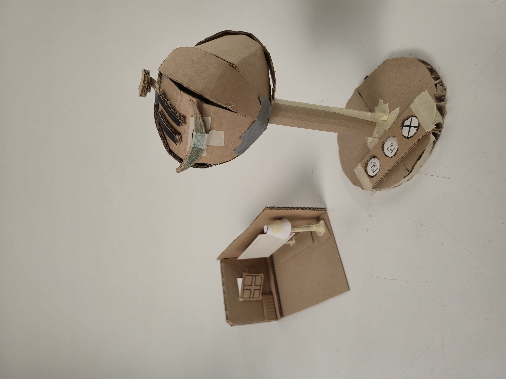
  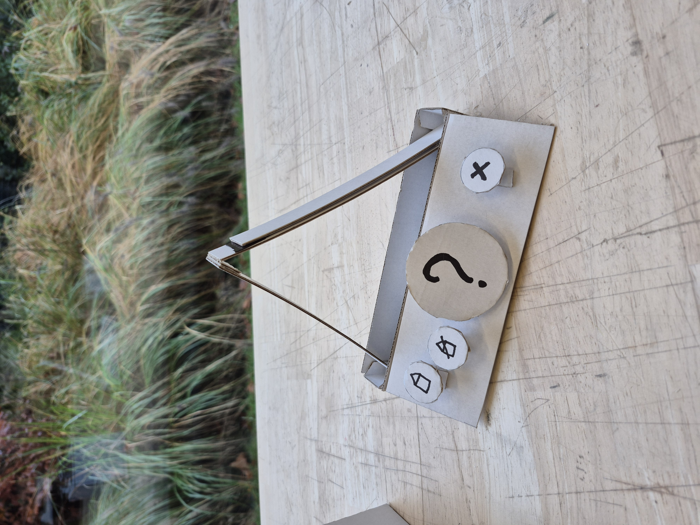
  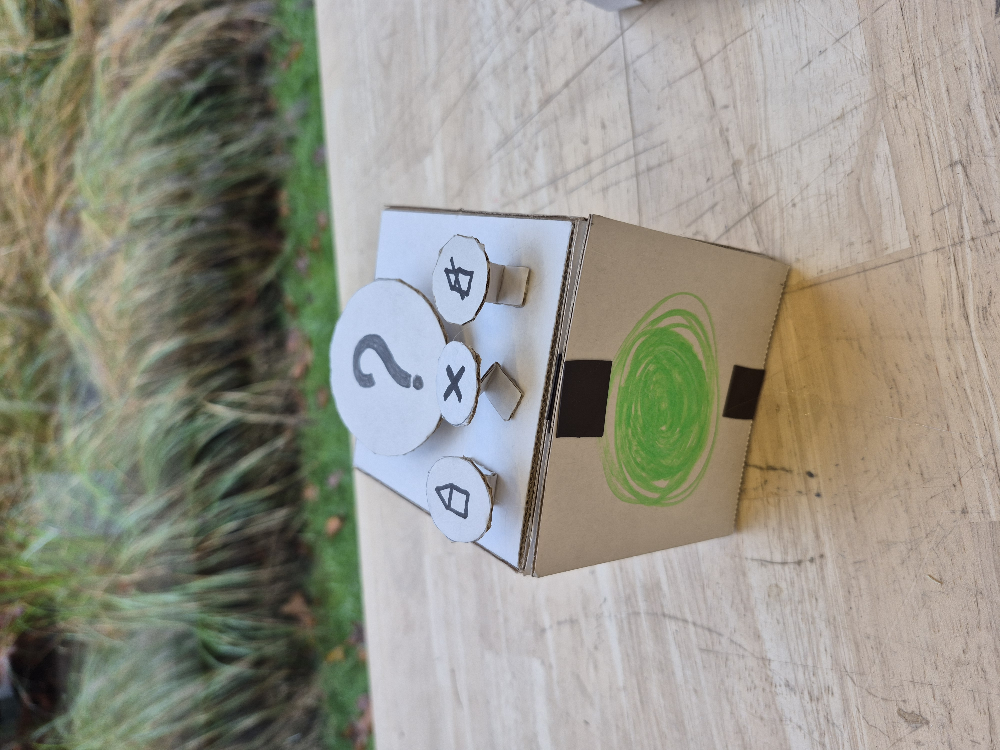
  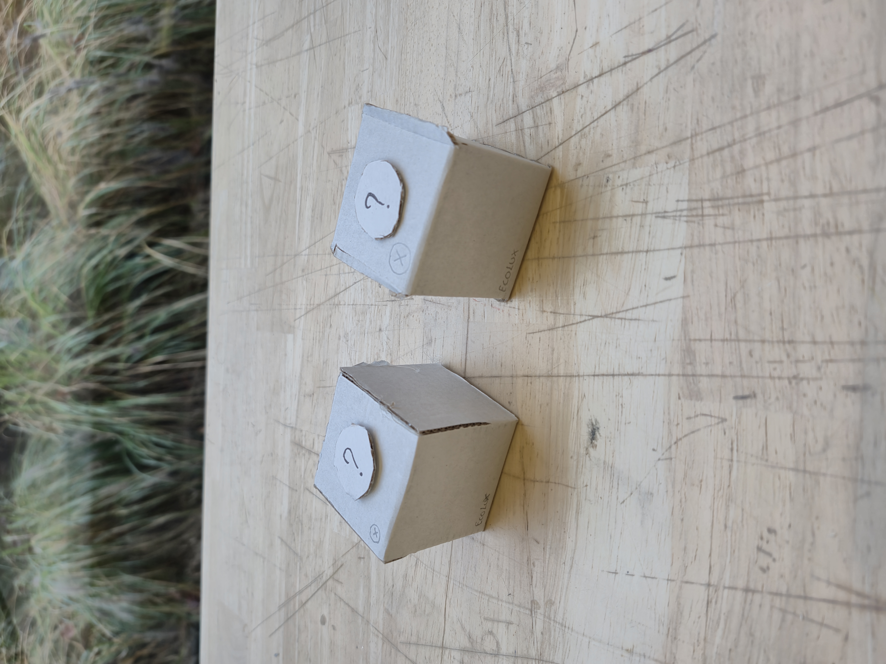

De 4 prototypes werden gebruikt om de gebruikers een fysieke voorstelling te geven voor de verschillende manieren van communiceren. De drie eerste protypes hadden elk een eigen manier voor het melden van een probleem, namelijk: emotie, vorm of licht. Het vierde prototype was voorzien voor het testen van het concept van de substations.

Tijdens de gebruikerstesten konden de gebruikers in interactie gaan met de verschillende prototypes. Hierbij werden de prototypes opgesteld in de verschillende modes, namelijk wanneer er zich energieverlies optreed en wanneer niet. Vervolgens konden de gebruikers passeren. Na elk protype werden er een aantal vragen gesteld. Uiteindelijk, na het doorlopen van alle prototypes werd een interview afgenomen over de gehele test.

  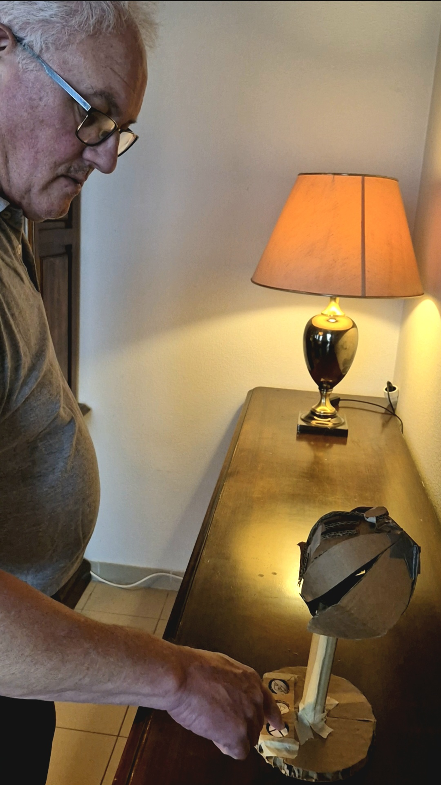
  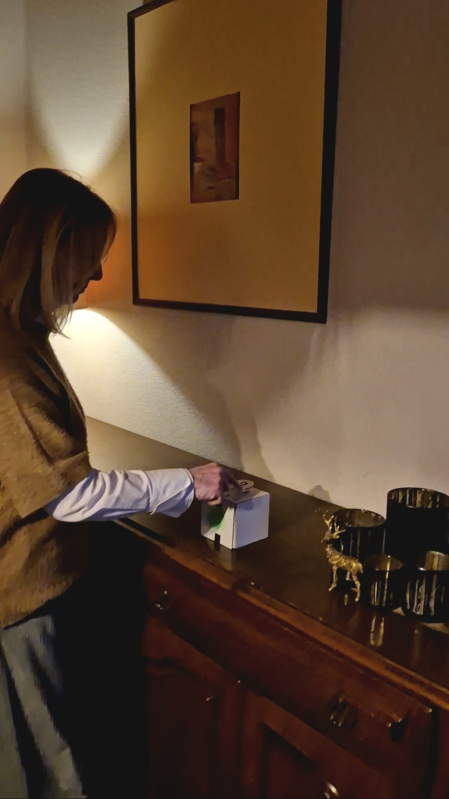

**Resultaten**  
Uit het onderzoek blijkt dat de duidelijkheid van signalen een belangrijke rol speelt in het gebruiksgemak. Lichtsiganalen worden consequent als het meest duidelijk ervaren. Emoties worden wel begrepen, maar passen minder goed binnen professionele contexten. De shapeshifter wordt als minder intuïtief gezien, tenzij deze visueel extra wordt ondersteund. Het gebruik van een smiley-prototype en het feit dat de prototypes kunnen praten, activeert bovendien een antropomorfe interpretatie. Gebruikers schrijven het systeem menselijke eigenschappen toe, zoals begrijpen, luisteren en reageren. Dit leidt ertoe dat sommige respondenten de neiging hadden om daadwerkelijk een gesprek aan te gaan met de prototypes.

De context van gebruik blijkt bepalend voor de voorkeur in vormgeving. Voor gezinnen werkt een speels en visueel systeem, zoals een smiley, goed. In zakelijke omgevingen en volwassen thuissituaties gaat de voorkeur uit naar een strak en minimalistisch ontwerp, zoals een cube.

Daarnaast verhoogt een persoonlijk aanpasbaar design de betrokkenheid van gebruikers. Respondenten geven aan dat personaliseerbaarheid, het gevoel versterkt dat het product echt van henzelf is.

Op het gebied van functionaliteit worden negeerknoppen en duidelijke voorinstellingen vaak genoemd als belangrijke toevoegingen. Substations verhogen de bruikbaarheid wanneer er meerdere kamers of ingangen zijn. Handsfree bediening draagt bij aan het gebruiksgemak, vooral in huishoudens waar regelmatig wordt gemultitaskt. In zulke situaties kan spraakbediening een duidelijke meerwaarde hebben, bijvoorbeeld met suggesties als dat het systeem pas begint te luisteren wanneer er daadwerkelijk iets gebeurt.

Wat betreft installatie geven alle respondenten aan dat plaatsing idealiter door een technieker of installateur gebeurt. Tegelijkertijd vindt één respondent het belangrijk dat er ook een optie blijft bestaan om het systeem zelfstandig te installeren.

### <ins>**Wave 2: Communicatie energieprobleem**</ins>  
**Doestellingen**  
In Wave 1 lag de focus vooral op awareness, installatie en basisfunctionaliteit, maar in Wave 2 werd verder ingezoomd op communicatie, automatisatie en het gebruik van de negeerfunctie. Concreet moesten drie deelvragen beantwoord worden: 
* Hoe brengen we de informatie van het energieverlies het best over?
* Wat verwacht de gebruiker dat de Ecolux automatisch doet en wat er manueel moet gebeuren, moet dit instelbaar zijn? 
* Hoe zou de negeerfunctie het best gebruikt worden?  

**Materiaal & methoden**

Voor dit onderzoek werd gekozen voor gebruikerstesten volgend het TAP (thinking aloud protocol) en QAP (question asking protocol), omdat we enerzijds gedrag in context wilden observeren en anderzijds ook inzicht wilden krijgen in motivaties en voorkeuren via interviewvragen. De methode liet toe om gerichte feedback te verzamelen op de prototypes en is praktijkgericht, snel uitvoerbaar en geschikt voor conceptevaluatie. De test werd uitgevoerd bij de respondenten thuis en verliep volgens een vaste structuur: introductie en informed consent, presentatie van het EcoLux-concept, testen van prototypes, observatie van gedrag met interviewvragen en een afsluitende wrap-up. 

Materialen:

* 1 prototype (Protopie) met drie interfaces (spraak, tekst en grondplan)

* smartphone voor de interface

* smartphone voor opnames

* protocol + informed consent 

  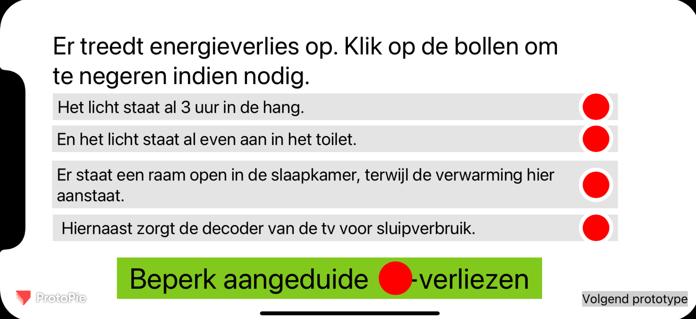
  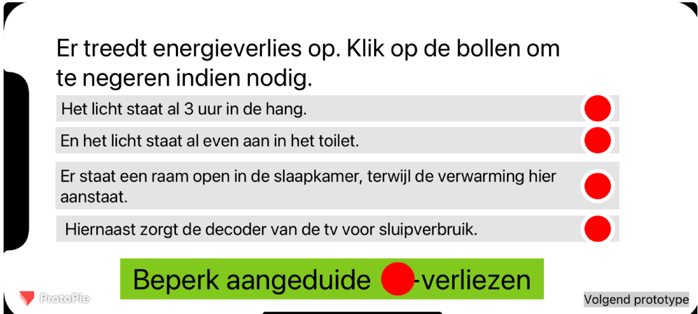

  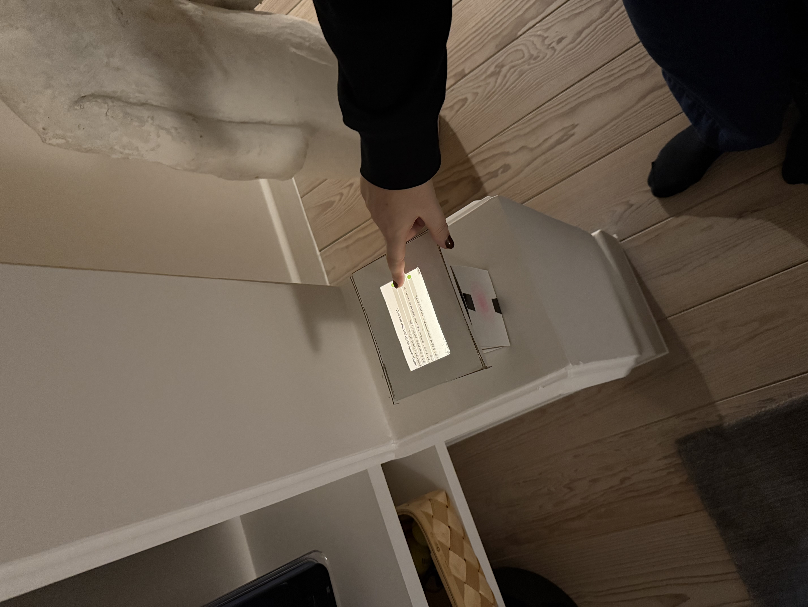
  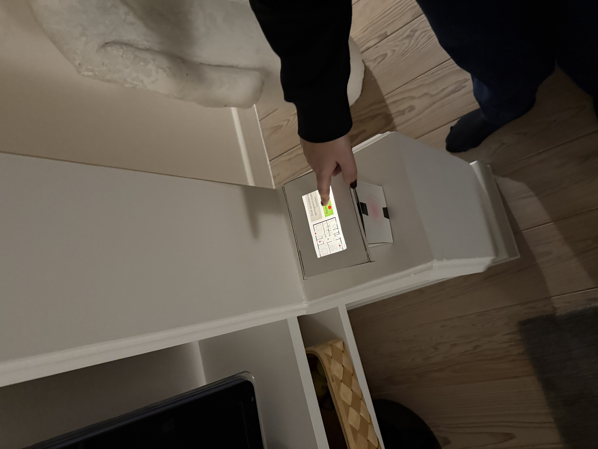
  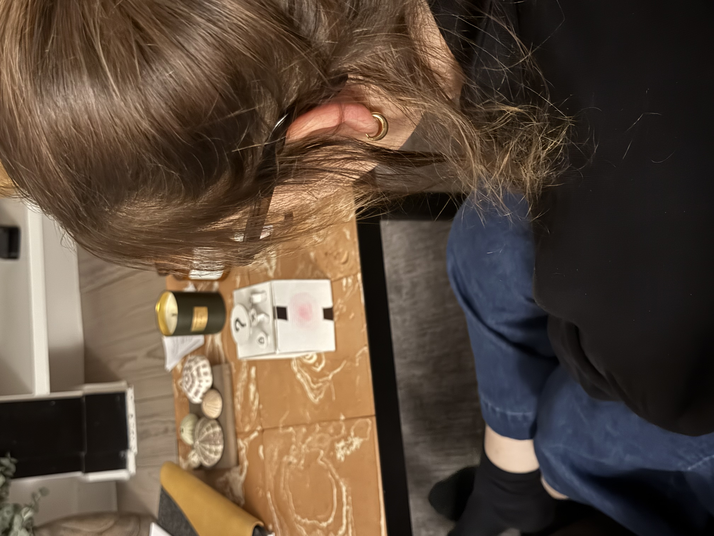

**Resultaten**

De resultaten tonen dat communicatie via spraak duidelijk kan zijn, maar minder geschikt wordt wanneer er veel informatie tegelijk is: respondenten gaven aan dat het dan moeilijk is om alles te onthouden en achteraf correct te herhalen. Daarnaast vonden sommigen het te traag, zeker wanneer ze liever meteen handelen of verwachten dat EcoLux automatisch ingrijpt. Tekst werd gezien als handig om snel te scannen en meteen actie te ondernemen, maar bleek soms te weinig context te geven: met beperkte tekst was het niet altijd duidelijk waar het probleem zich exact bevond. Bovendien kon de tekstweergave druk ogen wanneer er weinig witruimte was. De grondplanweergave scoorde het best: respondenten konden onmiddellijk zien waar het energieverlies zich bevond, wat snelle acties mogelijk maakte. Alle testers verkozen deze visuele methode boven tekst en spraak. Wat automatisatie betreft was er een duidelijke voorkeur: gebruikers wilden dat EcoLux zoveel mogelijk automatisch oplost, en voor hen hoeft dit zelfs niet uitgebreid instelbaar te zijn. De belangrijkste inzichten zijn dus dat visuele communicatie het sterkst werkt, snelheid essentieel is en maximale automatisatie aansluit bij gebruikersverwachtingen.

### Conclusies & implicaties
Wave 1 toont dat de duidelijkheid van signalen bepalend is voor gebruiksgemak: lichtsignalen worden het meest intuïtief ervaren, terwijl emotie en vorm minder geschikt zijn in professionele contexten. De voorkeur voor vormgeving hangt sterk af van de omgeving (speels voor gezinnen, strak/minimalistisch voor volwassen of zakelijke settings). Personalisatie verhoogt betrokkenheid. Functioneel zijn negeerknoppen, duidelijke presets, handsfree bediening en substations belangrijk, vooral in grotere woningen. Installatie gebeurt idealiter door een technieker, met een optie voor zelfinstallatie. Wave 2 bevestigt dat visuele communicatie het best werkt: grondplanweergave maakt energieverlies meteen begrijpelijk en actiegericht. Spraak is minder efficiënt bij veel info, tekst moet voldoende context en witruimte bieden. Gebruikers verwachten bovendien maximale automatisatie