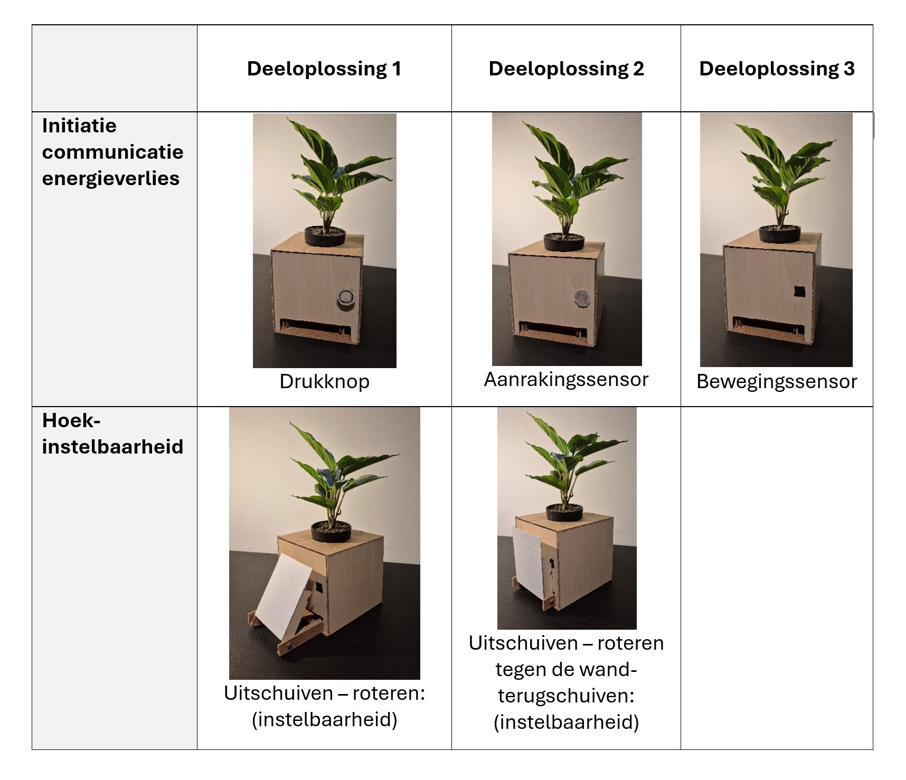

## Develop 1

Voor Develop 1 werden na de tussentijdse evaluatie enkele pivots gemaakt. Eerst werd de doelgroep aangepast. De focus verschoof van mensen die renoveren naar bewuste gezinnen die hun energieverbruik en energiekosten willen verlagen. Deze gezinnen zoeken een laagdrempelige manier om alle gezinsleden actief te betrekken. Uit verder onderzoek bleek dat deze doelgroep representatiever is en een grotere nood heeft.

Ook op vlak van ontwerp werd een duidelijke richting gekozen op basis van deze [scorematrix](https://github.com/Vic-Syryn/EcoLux/blob/main/onderzoek/Scorematrix_Develop_1_Conceptselectie.pdf). Hieruit bleek dat de slimme bloempot het meeste potentieel had. Dit ontwerp scoorde goed op esthetiek en gebruiksgemak. De pot vormt ook een passende metafoor voor EcoLux: hij ondersteunt een ecologischer levenswijze (Eco) en communiceert via licht (Lux).

### <ins>**Analyse en prioritering**</ins>

Bij de start van Develop 1 waren er nog enkele onzekerheden. Deze werden vertaald naar drie onderzoeksvragen:
1. Hoe moet het hoofdstation en substations eruit zien?
2. Hoe wordt het scherm geïnterageerd in het product?
3. Welke concepten hebben de meeste potentie om tot een sterk product te kunnen vertaald worden?

Het doel van deze fase was om op deze vragen een antwoord te krijgen. Alle drie waren even belangrijk voor de verdere ontwikkeling van EcoLux.

### <ins>**Deconstructie**</ins>

**Customer journey**

In de Customer Journey werd vooral ingezoomd op twee fasen: installatie en gebruik. Het doel was om de interacties van de gebruiker in kaart te brengen en waar mogelijk te optimaliseren.

<ins>Awareness</ins>

De gebruiker ervaart een hoge energiefactuur en wil besparen. Daarvoor moeten energieconsumptie en energieverliezen beperkt worden. Gebruikers willen dit met zo weinig mogelijk moeite doen, maar willen wel voldoende controle behouden. Er is dus nood aan een product dat energieverliezen minimaliseert en dit duidelijk communiceert.

<ins>Install</ins>

  

customer journey install

<ins>Use</ins>

  

customer journey use

<ins>Result</ins>

De energieconsumptie van de gebruiker daalt. Hierdoor bespaart hij of zij geld, wordt de ecologische voetafdruk kleiner en ontstaat er meer comfort rond energieverbruik thuis. Ook wordt het verlaten van het huis of gaan slapen makkelijker, omdat alle energieverbruikers uit gezet kunnen worden met 1 knop.

**Storyboards**

Op basis van de Use-fase in de Customer Journey werd een storyboard gemaakt. Hierin worden de verschillende interacties met het product visueel weergegeven.

  

  storyboard

**Productarchitectuur**

Op basis van de Storyboard en Customer Journey werden de belangrijkste componenten en functies opgesteld.

  

productarchitectuur

**Userflow en informatiearchitectuur**

De userflow visualiseert het volledige interactieproces tussen gebruiker en systeem. Ze toont hoe de gebruiker van het opmerken van energieverlies naar het aanpassen en oplossen ervan gaat. Zo wordt duidelijk waar interactie plaatsvindt.

  

userflow

De HTA toont de taken die nodig zijn om energieverliezen te beperken. De hoofddoelstelling wordt opgesplitst in drie taken: de gebruiker informeren, keuzes maken op het hoofdstation en het systeem terugbrengen naar de basisinstellingen. Elke taak wordt verder opgedeeld in subtaken.

  

HTA

Uit de userflow en HTA bleek dat de communicatie van het type energieverlies nog verder bepaald moest worden.

**MVP-defenitie**

Deze MVP’s tonen de minimale kernfunctionaliteiten van het systeem.

  

MVP

### <ins>**Divergentie & ontwerpkeuzes**</ins>

**Morfologische matrix**

Op basis van de deconstructie werd een morfologische matrix gemaakt. Deze geeft een visueel overzicht van mogelijke deeloplossingen.

  

morfologische matrix

### <ins>**Build & test**</ins>

**Doestellingen** 

De gebruikerstesten hadden als doel om inzicht te krijgen in de meest efficiënte en aangename interactie met het scherm van EcoLux. Tijdens de userflow bleek er onzekerheid over hoe het scherm best tevoorschijn komt en opnieuw verdwijnt in de pot. Door prototypes te testen bij gebruikers thuis, werd onderzocht welke interacties het meest intuïtief, comfortabel en gebruiksvriendelijk zijn.

**Materiaal & methoden**

Voor de gebruikerstesten werden verschillende materialen gebruikt:

* Prototype van het EcoLux-hoofdstation

* Smartphone voor foto’s en video-opnames

* Informed consent-document voor toestemming van de deelnemers

  
  

fysiek prototype

De testen werden uitgevoerd bij de respondenten thuis om het product in een realistische context te observeren. In totaal namen vijf deelnemers deel, met verschillende profielen en niveaus van technologische ervaring. Ze kregen taken zoals het scherm uit het prototype halen, dit herhalen op verschillende hoogtes, de kijkhoek aanpassen en het scherm terugplaatsen. Observaties werden genoteerd en aangevuld met vragen volgens TAP en QAP.

**Resultaten**

Uit de gebruikerstesten kwamen verschillende inzichten naar voren over de interactie met het scherm.

  

prototype bij gebruikerstest

Een volledig handmatig uittrekbaar scherm bleek niet intuïtief. Deelnemers wisten niet altijd hoe ze het scherm moesten activeren. Een volledig automatisch systeem was ook niet ideaal, omdat het scherm op ongewenste momenten kon verschijnen. Gebruikers gaven daarom de voorkeur aan een duidelijke en gecontroleerde interactie, bijvoorbeeld via een knop.

Daarnaast beïnvloedde de plaatsing van de knop de stabiliteit. Wanneer de knop vooraan stond, schoof de pot naar achteren wanneer gebruikers erop drukten. Dit toont dat de stabiliteit en richting van de interactiekracht belangrijk zijn.

Ook de ergonomie van het scherm bleek belangrijk. Wanneer het product lager stond, bevond het scherm zich onder een ongunstige kijkhoek. Gebruikers gaven daarom aan dat de kijkhoek best aanpasbaar is.

Tot slot verwachtten gebruikers dat het scherm op dezelfde manier verdwijnt als het verschijnt. De meeste deelnemers drukten opnieuw op dezelfde knop. Dit wijst op een voorkeur voor consistente interacties.

### <ins>**Conclusies & implicaties**</ins>

De gebruikerstesten helpen de drie onderzoeksvragen te beantwoorden. Voor de interactie met het scherm werd duidelijk dat gebruikers een gecontroleerde en eenvoudige activatie verwachten. Zowel een volledig handmatig als volledig automatisch systeem was minder wenselijk. Consistentie is belangrijk: dezelfde handeling moet het scherm kunnen tonen en verbergen.

Voor het hoofdstation bleek stabiliteit essentieel. Het object mag niet verschuiven wanneer de gebruiker erop drukt. Ook de plaatsing van interactie-elementen moet zorgvuldig gekozen worden. Daarnaast moet het scherm ergonomisch leesbaar blijven op verschillende hoogtes.

De testfase gaf ook inzicht in het concept met het meeste potentieel. Het oorspronkelijke idee met een uitschuifbaar en kantelbaar scherm zorgde voor problemen rond gebruiksvriendelijkheid, stabiliteit en mechanische complexiteit. Het mechanisme maakte het ontwerp minder robuust en beperkte de ontwerpvrijheid van de bloempot.

Daarom werd beslist om het verborgen schermconcept te verlaten. Het scherm wordt geïntegreerd als zichtbaar en vast onderdeel van het productdesign. Zo verschuift EcoLux naar een eenvoudiger, robuuster en ergonomischer product, met gebruiksgemak, stabiliteit en betrouwbaarheid als basis.