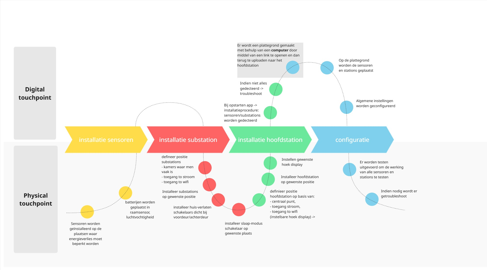
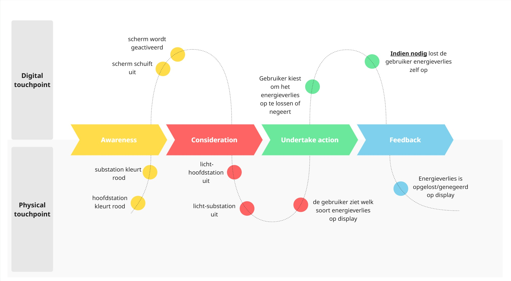
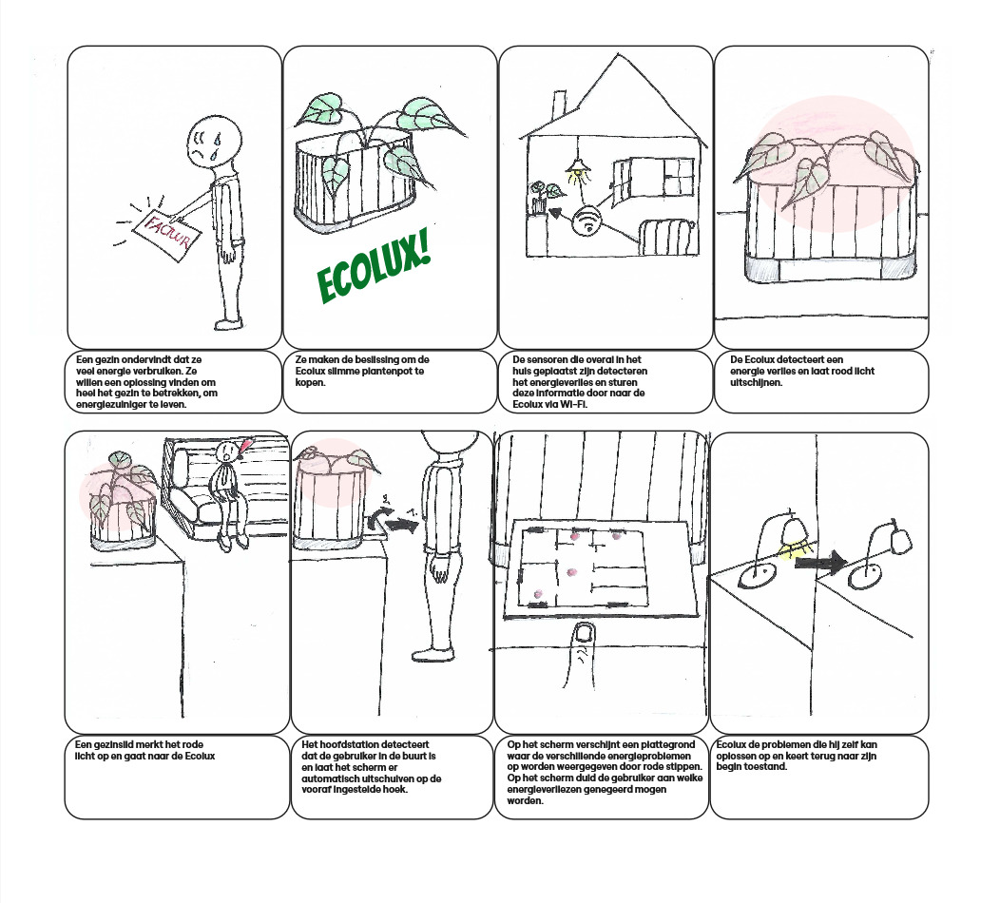
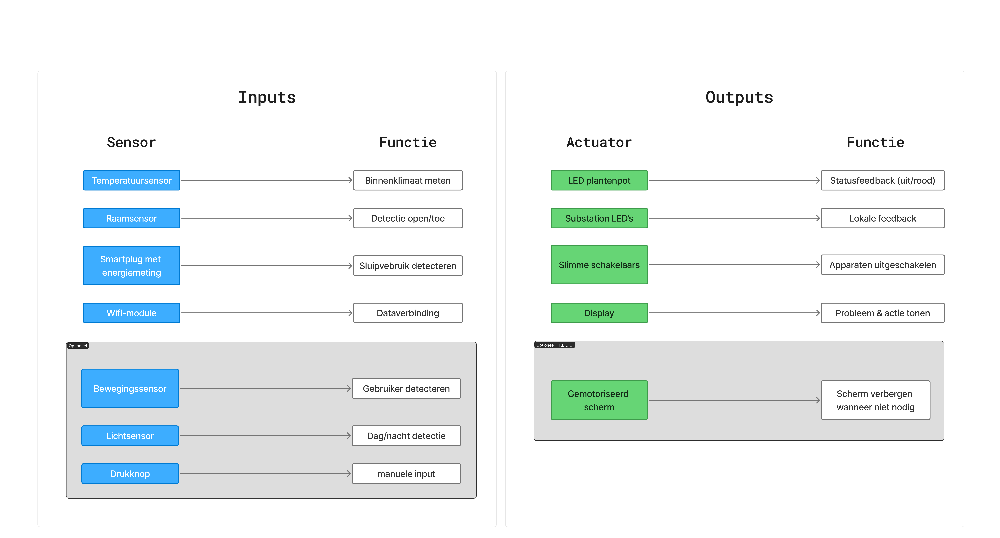
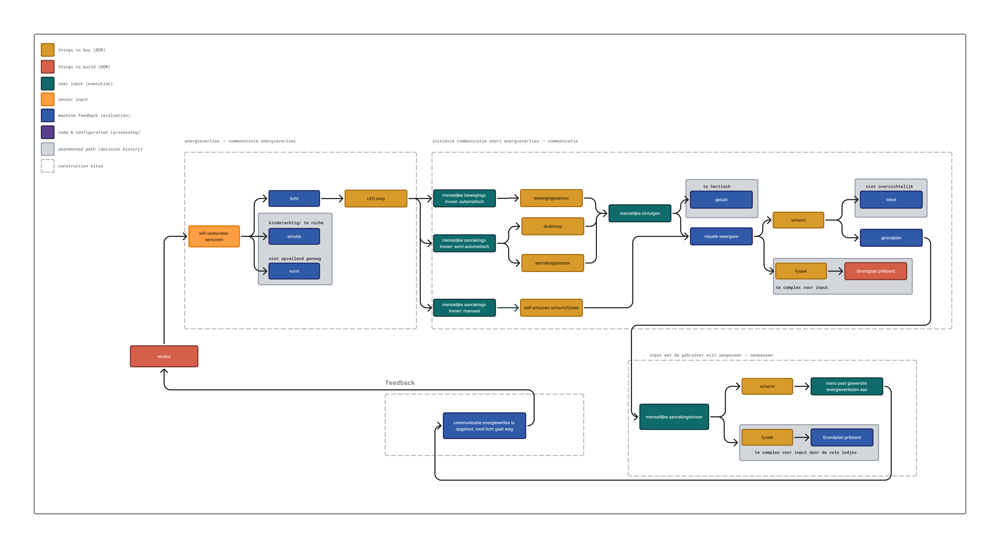
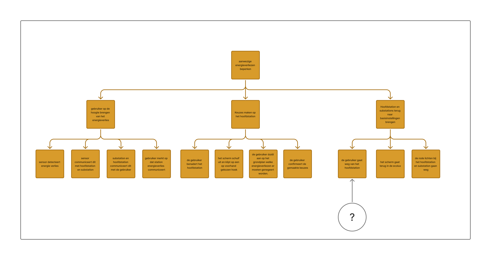
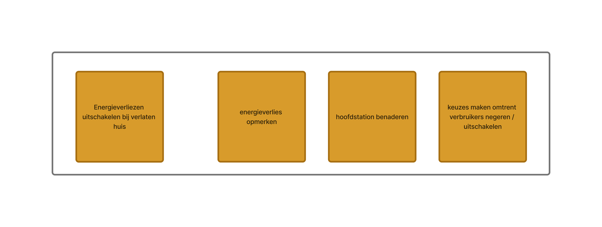
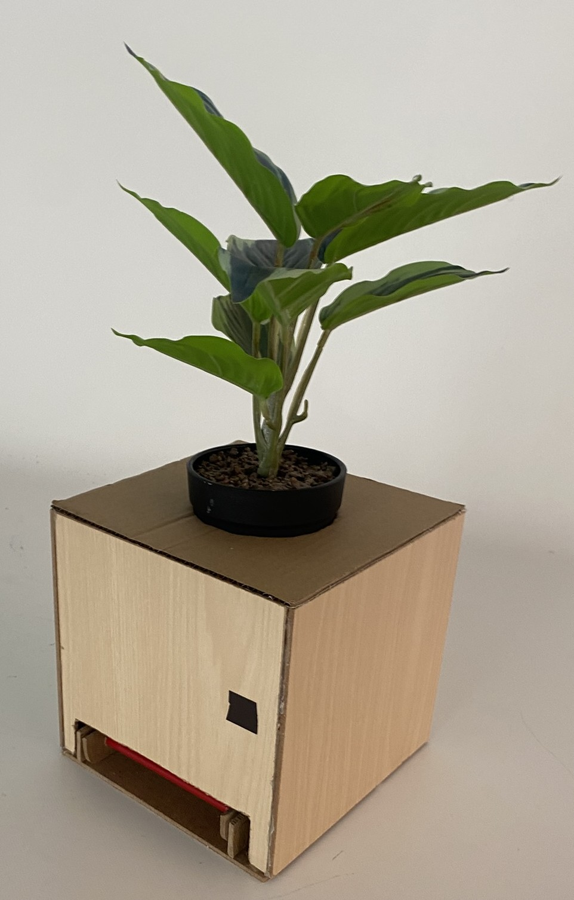
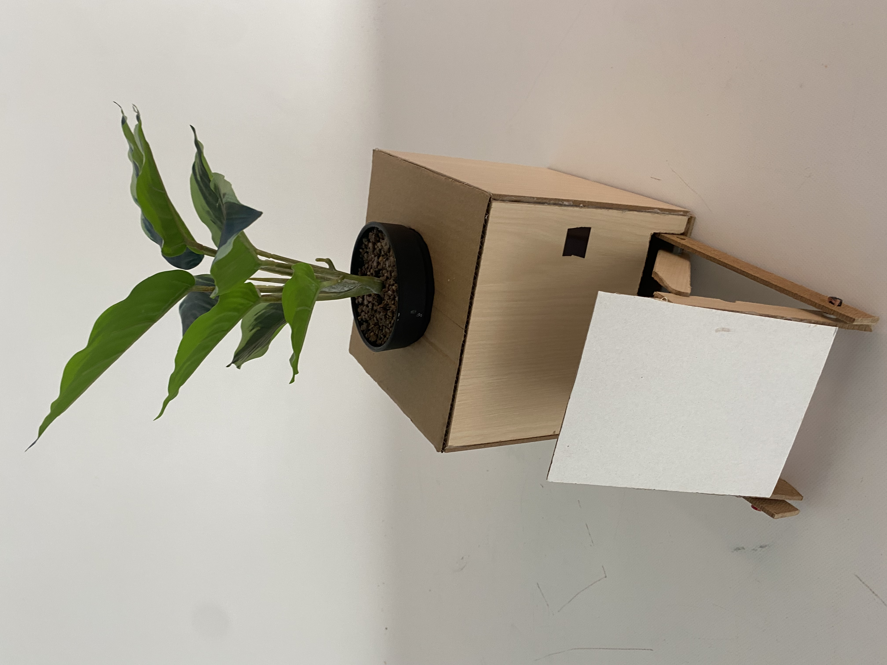
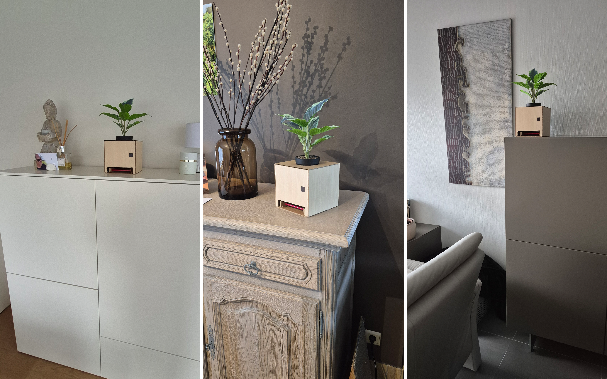

## Develop 1
Voor we aan Develop 1 begonnen zijn, hebben we na de tussentijdse evaluatie nog een paar kleine pivots gemaakt. 

Allereerst hebben we onze doelgroep aangepast. Voorheen was onze doelgroep mensen die renoveren, nu is onze doelgroep  bewuste gezinnen die hun energieverbruik en energiekosten willen verlagen en op zoek zijn naar een laagdrempelige manier om alle gezinsleden actief te betrekken. De reden waarom er voor deze doelgroep is gekozen omdat na verder onderzoek merkten we dat deze doelgroep meer representatief en een stuk groter is.

Vervolgens hebben we op vlak van ontwerp ook een concrete richting gekozen op basis van deze scorematrix: [Scorematrix](https://github.com/Vic-Syryn/EcoLux/blob/main/reports%20and%20protocols/Scorematrix_Develop_1_Conceptselectie.pdf).  Hieruit bleek dat er wordt verder gegaan met de slimme bloempot, dit ontwerp is een goede allrounder, met goede esthetiek en potentieel gebruiksgemak. De pot is trouwens ook een mooi metafoor voor ons product, doordat hij zorgt voor een ecologischer (Eco) levenswijze, door dit te laten weten via licht (Lux).

### <ins>**Analyse en prioritering**</ins>

### <ins>**Deconstructie**</ins>

**Customer journey**

In deze Customer Journey wordt vooral ingezoomed op 2 fasen: namelijk de installatie en het gebruik van de EcoLux. Hiermee is de bedoeling om de interacties van de gebruiker in kaart te brengen en deze te optimaliseren waar mogelijk.

<ins>Awareness</ins>

Gebruiker ondervindt hoge energiefactuur
--> hij wil hierop besparen
     --> energieconsumptie/energieverliezen moeten beperkt worden

Gebruikers willen dit beperken met zo weinig mogelijk moeite maar willen voldoende controle.

Hierdoor is er nood aan een product dat energieverliezen minimaliseert en dit laat weten aan de gebruiker.

<ins>Install</ins>

  

<ins>Use</ins>

  

<ins>Result</ins>

De gebruiker zijn/haar energieconsumptie gaat omlaag, hij/zij:
-> bespaart geld en heeft een kleinere ecologische voetafdruk.
-> heeft een groter comfort omtrent zijn of haar energieverbruik thuis.
-> heeft een grotere gebruiksgemak bij het verlaten van het huis en het slapen.
-> heeft een beter besef van zijn of haar energieverbruik.

**Storyboards**

Op basis van de Use-fase in de Customer Journey werd er een Storyboard gemaakt waarin de verschillende interacties met het product visueel worden weergegeven.

  

**Productarchitectuur**

Uit de Storyboard en Customer Journey werden er op basis van de verschillende componenten functies opgesteld.

  

**Userflow en informatiearchitectuur**

Deze userflow dient om het volledige interactieproces tussen gebruiker en het systeem te visualiseren, van het opmerken van een energieverlies tot het aanpassen en oplossen ervan. Ze helpt dus om te begrijpen hoe een gebruiker door het systeem geleid wordt en waar interactie plaatsvindt.

  

Deze HTA toont de hiërarchie van taken die nodig zijn om aanwezige energieverliezen te beperken. De hoofddoelstelling wordt opgesplitst in drie hoofdtaken: de gebruiker op de hoogte brengen van het energieverlies, keuzes maken op het hoofdstation en het systeem terugbrengen naar de basisinstellingen. Elke hoofdtaak wordt verder onderverdeeld in subtaken.

  

Uit de userflow en de HTA bleek dat de manier waarop we de initiatie van het soort energieverlies gaan communiceren nog moest bepaald worden.

**MVP-defenitie**

Deze MVP’s tonen de minimale kernfunctionaliteiten van het systeem.

  

### <ins>**Divergentie & ontwerpkeuzes**</ins>

**Morfologische matrix**

### <ins>**Build & test**</ins>

**Doestellingen** 
De gebruikerstesten hadden als doel om inzicht te krijgen in de meest efficiënte en aangename manier waarop gebruikers kunnen interageren met het scherm van het EcoLux-product. Tijdens het ontwerp van de user flow bleek er namelijk onzekerheid te bestaan over hoe het scherm het best tevoorschijn kan komen en terug kan verdwijnen in de pot. Door prototypes te testen bij verschillende gebruikers in hun eigen thuisomgeving, werd onderzocht welke interacties het meest intuïtief, comfortabel en gebruiksvriendelijk zijn. De verzamelde feedback en observaties moesten helpen om de interactie met het scherm beter te begrijpen en om het concept verder te ontwikkelen naar een onderbouwde functionele architectuur en een gebruiksvriendelijk ontwerp.

**Materiaal & methoden**
Voor de gebruikerstesten werden verschillende materialen gebruikt:

* Prototype van het EcoLux-hoofdstation

* Smartphone voor foto’s en video-opnames

* Informed consent-document voor toestemming van de deelnemers

  
  

De testen werden uitgevoerd bij de respondenten thuis om het gebruik van het product in een realistische context te observeren. In totaal namen vijf deelnemers deel, met verschillende profielen en niveaus van technologische ervaring. Tijdens de test kregen de deelnemers een aantal taken: het scherm uit het prototype halen zonder hulp, dit herhalen op verschillende hoogtes, de kijkhoek van het scherm aanpassen en het scherm opnieuw terugplaatsen in het object. Tijdens deze interacties werden observaties genoteerd en werden aanvullende vragen gesteld volgens het Think Aloud Protocol (TAP) en Question Asking Protocol (QAP), zodat zowel gedrag als motivaties van de gebruikers konden worden geanalyseerd.

**Resultaten**
Uit de gebruikerstesten kwamen verschillende inzichten naar voren over de interactie met het scherm van het EcoLux-product.

  

Ten eerste bleek dat een volledig handmatig uittrekbaar scherm niet intuïtief was voor gebruikers. Verschillende deelnemers wisten niet onmiddellijk hoe ze het scherm moesten activeren of vonden de interactie onduidelijk. Een volledig automatisch systeem bleek echter ook niet ideaal, omdat het scherm soms op ongewenste momenten tevoorschijn kon komen. Gebruikers gaven daarom de voorkeur aan een duidelijke en gecontroleerde interactie, bijvoorbeeld via een knop. 

Daarnaast werd vastgesteld dat de plaatsing van de interactieknop invloed had op de stabiliteit van het object. Wanneer de knop zich aan de voorkant van de bloempot bevond, schoof het object naar achteren wanneer gebruikers erop drukten. Dit wees op een probleem met de stabiliteit en de richting van de interactiekracht. 

Een ander belangrijk resultaat had betrekking op de ergonomie van het scherm. Wanneer het product op een lagere hoogte stond, zoals op een lage kast of tafel, bevond het scherm zich onder een ongunstige kijkhoek. Hierdoor werd het moeilijker om het scherm comfortabel af te lezen en te gebruiken. Gebruikers gaven daarom aan dat de kijkhoek van het scherm idealiter aanpasbaar moet zijn. 

Tot slot bleek dat gebruikers verwachtten dat het scherm op dezelfde manier zou verdwijnen als het verschijnt. De meeste deelnemers probeerden opnieuw op dezelfde knop te drukken om het scherm terug in de behuizing te laten verdwijnen, wat wijst op een voorkeur voor consistente interacties binnen het product.

**Conclusies & implicaties**

