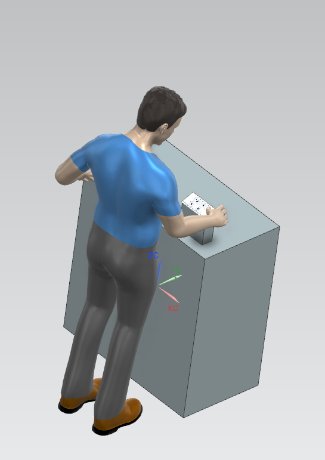
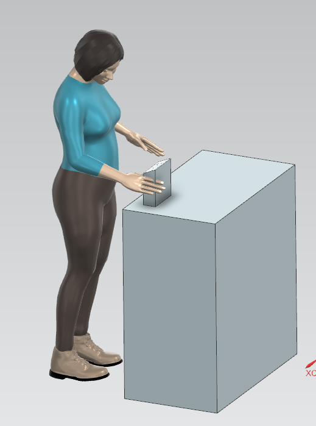
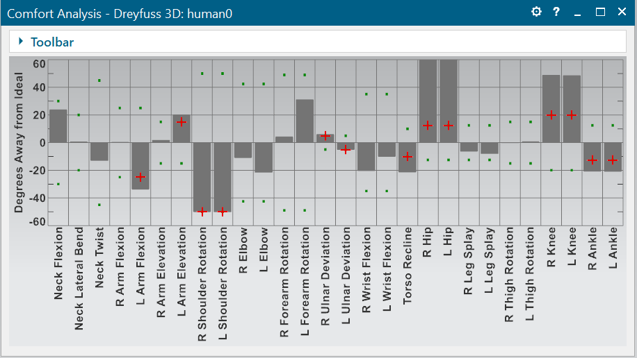
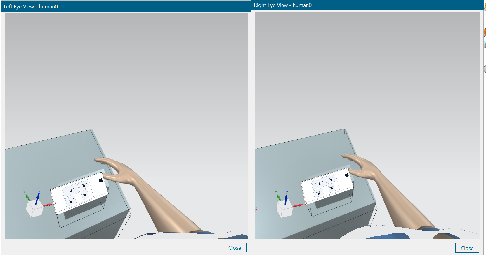
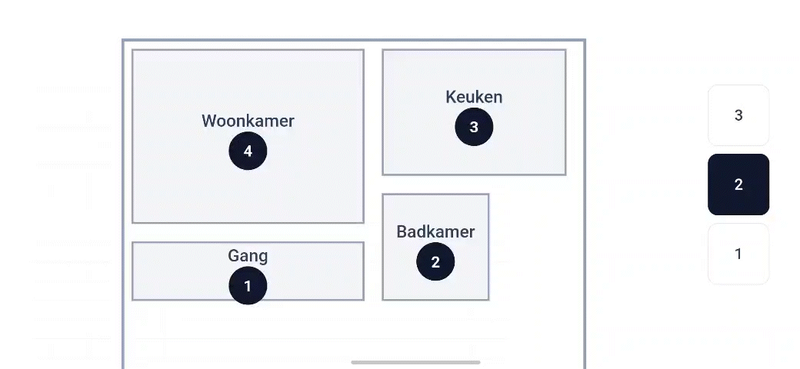
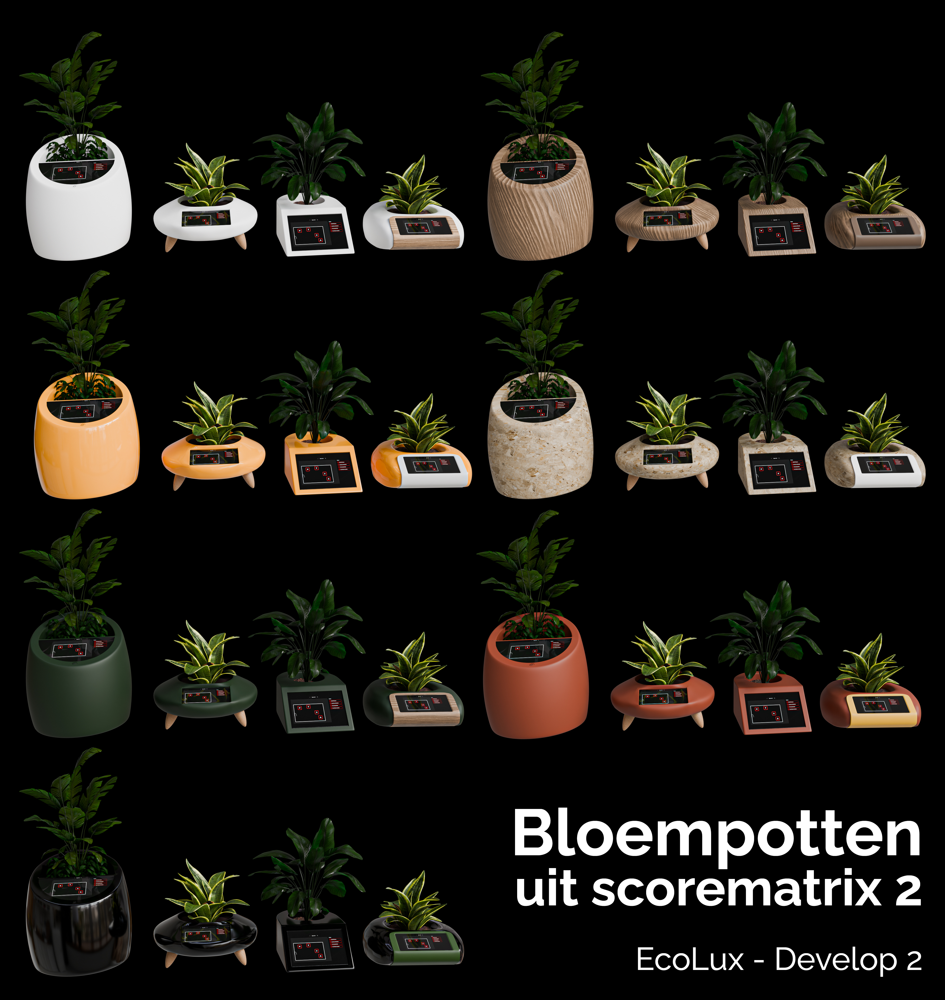

## Develop 2

Door de conclusies uit Develop 1 waaruit o.a. bleek dat het scherm niet instelbaar moest zijn, was er nu voldoende informatie om het design van het hoofdstation te beginnen bepalen en te valideren. De 11 beste schetsen werden opgenomen in een [Scorematrix (Develop 2)](https://github.com/Vic-Syryn/EcoLux/blob/main/reports%20and%20protocols/Scorematrix_Develop_2.pdf) en hieruit werden de 4 meest belovende geselecteerd op vlak van esthetiek, schermintegratie, haalbaarheid en potentieel gebruiksgemak. Op deze 4 vormen zullen de volgende usability goals bepaald worden.

### <ins>**Usability goals**</ins>

Ergonomie: de gemiddelde man/vrouw moet het product kunnen gebruiken met minimale ergonomische belasting. (Siemens Jack)

Cognitieve & sensoriele ergonomie: Gebruikers (18–65 jaar) kunnen kerntaken in de app (bv. navigeren, informatie lezen en acties uitvoeren) binnen 30 seconden voltooien, met maximaal 1 fout per taak en een subjectieve leesbaarheidsscore van ≥ 4/5.

### <ins>Theoretische antropometrie</ins>
Om de ideale kijkhoek voor het scherm te bepalen vóór de start van de fysieke prototypefase, werd een ergonomische simulatie uitgevoerd in Siemens Jack [(analyse)](https://github.com/Vic-Syryn/EcoLux/blob/main/onderzoek/Ergonomie%20scherm%20Siemens%20Jack.pdf), waarbij gebruik werd gemaakt van een digitaal mensmodel op basis van antropometrische data. De 'design for the mean'-methode werd toegepast door gebruik te maken van het 50e percentiel.
Als referentiehoogte voor de plaatsing van de Ecolux werd eerst de eettafelhoogte onderzocht. De gemiddelde eettafelhoogte is 74 cm. Uit de simulatie bleek echter dat deze hoogte onvoldoende is voor comfortabel gebruik, ongeacht de ingestelde kijkhoek. Daarom werd overgestapt naar een plaatsing op dressoir­hoogte, circa 90 cm, wat een ergonomisch betere uitgangspositie biedt.

  
  

simulatie gebruik gem man en vrouw 

  

Simulatie belasting

  

POV gebruiker

Uit de analyse bleek een schermhoek van 23° optimaal: bij deze hoek is de belasting op nek en rug minimaal, terwijl het scherm goed leesbaar blijft.

### <ins>**Cognitieve & sensoriele ergonomie**</ins>
Om met de Ecolux in interectie te gaan moet er een digitale interface gemaakt worden. Op basis van de interface van de 2de wave van de defenition fase werd er een verbeterde interface gamaakt met Figma make. Om te voldoen aan de tweede usability goal werd de interface ontworpen met de Gestaltwetten in het achterhoofd. De interface is ook zo simpel mogelijk om de cognitieve belasting te minimaliseren. Verdere optimalisatie zijn het gebruik van liftknoppen als metafoor om de juiste verdieping te kiezen en icoontjes voor de energieverliezende apparaten als signifiers.

  

app interface

### <ins>**Build & test**</ins>

**Doelstellingen**

De gebruikerstesten hadden als doel te peilen naar welke vorm er wordt ervaren als het meest esthetisch en praktisch. Naast de vormen werden er meerdere schermgroottes getest die modulair op de verschillende vormen passen. Op het scherm zal een demoversie van de interface te zien zijn. Ook wordt er gekeken of de hoek die bepaald werd in het document 'Ergonomie scherm – Siemens Jack' in de realiteit als aangenaam wordt ervaren. 

**Prototypes**

Met de 4 hoofdvormen, de ideale hoek van het scherm en een interactief digitaal interface, kon er overgegaan worden naar het maken van prototypes voor de gebruikerstesten. Omdat enkel schetsen de mensen geen goed beeld geeft van de omvang en de interactie met het product, werd er gekozen om via subdivision-modeling de 4 schetsen na te maken in Blender. Op basis van deze voorlopige 3D-modellen konden er telkens 3 aanzichten gegenereerd worden die dan werden afgedrukt op ware grootte. Deze werden aangebracht op polystyreen schuimblokken, waaruit de vorm dan gesneden kon worden door de aanzichten te volgen. Deze schuimmodellen geven de respondenten een goed beeld van de mogelijke omvang en geeft hun iets om vast te nemen. Daarnaast is het dus ook cruciaal om de grootte van het scherm te bepalen, hierdoor werden 4 verschillende groottes van een screenshot van de interface afgedrukt. Deze kunnen dus modulair per vorm verwisseld worden waardoor er 16 mogelijke combinaties zijn.

  

fysieke prototypes

Een bijkomend voordeel van de 3D-modellen was dat deze gerenderd konden worden op 7 verschillende manieren. Dit geeft de respondenten een goed beeld van hoe het product er in de toekomst zou kunnen uitzien.

  

render prototypes

**Materialen**

Voor de gebruikerstesten werden verschillende materialen gebruikt:

* Hoofdstationprototypes 

* Render

* Schermgrootte prototypes

* Smartphone voor interface demo 

* Valse plant 

* Smartphone voor opnames/foto's 

* Informed consent 

**Methoden**

De gebruikerstesten werden uitgevoerd bij de respondenten thuis om het product in een realistische gebruikscontext te evalueren. In totaal namen vijf deelnemers deel met uiteenlopende profielen en niveaus van technologische ervaring, wat zorgde voor een brede kijk op het gebruik van het product.

Tijdens de testen gingen de deelnemers in interactie met verschillende prototypes van het hoofdstation, waarbij vorm, schermgrootte en interface werden beoordeeld. De prototypes werden in de leefomgeving geplaatst, zodat het gebruik op een natuurlijke manier kon worden geobserveerd.

Om zowel gedrag als motivaties te begrijpen, werd gebruik gemaakt van het Think Aloud Protocol (TAP) en het Question Asking Protocol (QAP). Hierdoor konden niet alleen handelingen, maar ook onderliggende voorkeuren en problemen in kaart worden gebracht, wat de basis vormde voor verdere analyse en ontwerpbeslissingen.

  

interactie gebruikerstest

**Resultaten**

Uit de gebruikerstesten kwamen verschillende inzichten naar voren over de vormgeving, schermgrootte en interface van het EcoLux-product.

Ten eerste bleek dat vormgeving een belangrijke rol speelt in hoe het product wordt ervaren binnen een interieur. Gebruikers gaven duidelijk de voorkeur aan een compacte en elegante vorm, waarbij vooral vorm 2 als het meest aantrekkelijk werd beschouwd. Deze vorm werd als esthetisch en passend in de leefomgeving ervaren, mede door de zachte en minder opvallende uitstraling. Grotere en massievere vormen werden minder positief onthaald, omdat ze als lomp of te dominant werden gezien. Dit toont aan dat het product visueel aanwezig mag zijn, maar zich tegelijk subtiel moet integreren in de omgeving.

Daarnaast werd vastgesteld dat de schermgrootte een cruciale invloed heeft op het gebruiksgemak. Te kleine schermen zorgden ervoor dat icoontjes moeilijk zichtbaar waren en dat gebruikers sneller fouten maakten bij interactie, wat leidde tot frustratie en tijdverlies. Anderzijds werden te grote schermen als overdreven ervaren voor de functie van het product en zelfs als storend binnen het interieur. Gebruikers gaven daarom de voorkeur aan een gebalanceerde schermgrootte die voldoende leesbaarheid biedt, zonder dat het product zijn compacte karakter verliest.

Ook de interface werd over het algemeen als duidelijk en overzichtelijk ervaren, zeker eens gebruikers vertrouwd waren met de werking. Elementen zoals de plattegrond en de lijst met apparaten werden als nuttig beschouwd. Toch kwamen er enkele belangrijke verbeterpunten naar voren. Zo waren icoontjes niet altijd meteen begrijpelijk, waardoor extra ondersteuning zoals labels of een legende gewenst is. Daarnaast werd aangegeven dat de interface visueel aantrekkelijker kan, bijvoorbeeld door gebruik te maken van kleurcodering per ruimte en een zachtere, minder "droge" vormgeving.

Tot slot bleek dat efficiëntie en gebruiksgemak centraal staan in de interactie met het product. Gebruikers verwachten snelle en logische handelingen, zoals het in één keer selecteren van alle apparaten binnen een ruimte. Ook werd een duidelijke voorkeur uitgesproken voor een systeem waarbij gebruikers kiezen wat uitgeschakeld moet worden, in plaats van wat genegeerd moet worden. Verder werd de nood aan extra informatie en feedback, zoals inzicht in energieverbruik en periodieke overzichten, meerdere keren aangehaald. Dit soort informatie verhoogt niet alleen het gebruiksgemak, maar ook de betrokkenheid en motivatie van de gebruiker.

### <ins>Conclusies en implicaties</ins>

De gebruikerstesten leverden belangrijke inzichten op die helpen om de centrale onderzoeksvragen van deze fase te beantwoorden.

Ten eerste werd duidelijk welke vorm het meest geschikt is voor het hoofdstation (onderzoeksvraag 1). Gebruikers gaven duidelijk de voorkeur aan een compacte en elegante vorm die goed past in het interieur. Vorm 2 kwam hierbij het sterkst naar voren. Grotere en zwaardere vormen werden als te opvallend en minder aantrekkelijk ervaren. Dit toont aan dat het product visueel aanwezig mag zijn, maar niet mag domineren in de ruimte.

Daarnaast werd meer inzicht verkregen in de ideale schermgrootte en ergonomie (onderzoeksvraag 2). Gebruikers verkiezen een middelgroot scherm dat goed leesbaar is zonder te groot te zijn. Kleine schermen zorgen voor fouten en frustratie, terwijl grote schermen als overdreven worden gezien. Ook is het belangrijk dat het scherm onder 23 graden staat, zoals blijkt uit Siemens jack simulatie, dit zorgt namelijk voor de minste strain. Deze hoek werd ook geverifieerd tijdens de gebruikerstesten.

Tot slot werd duidelijk hoe de interface verder verbeterd kan worden (onderzoeksvraag 3). De basis wordt als duidelijk ervaren, maar er zijn nog verbeterpunten. Icoontjes moeten duidelijker zijn en extra uitleg kan helpen, bijvoorbeeld via labels of een legende. Ook kan de interface visueel aantrekkelijker gemaakt worden met kleurgebruik en een zachtere vormgeving. Gebruikers verwachten daarnaast snelle en eenvoudige interacties, zoals het selecteren van meerdere apparaten tegelijk.

Op basis van deze inzichten wordt het ontwerp verder ontwikkeld naar een product dat eenvoudig in gebruik is, er goed uitziet en logisch werkt. Zowel de vorm als de interface moeten bijdragen aan een duidelijke en aangename gebruikerservaring.
