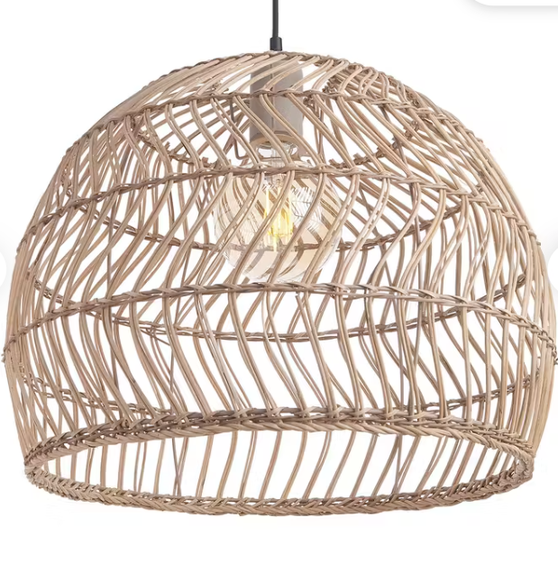
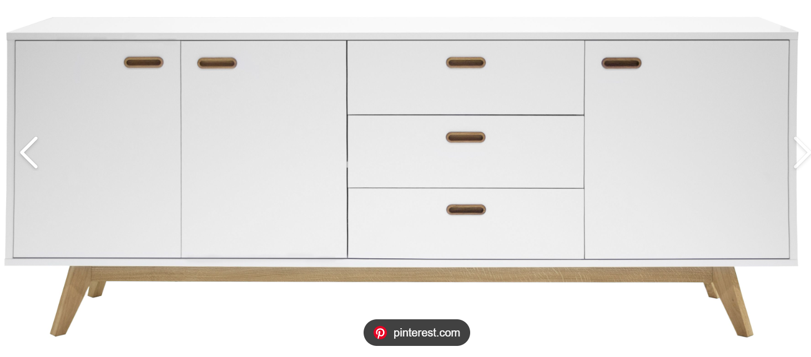
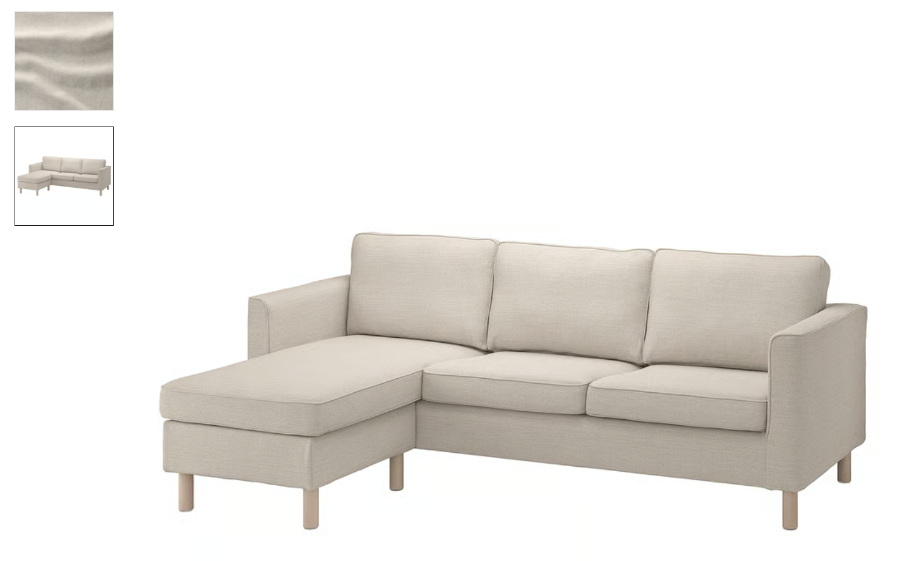
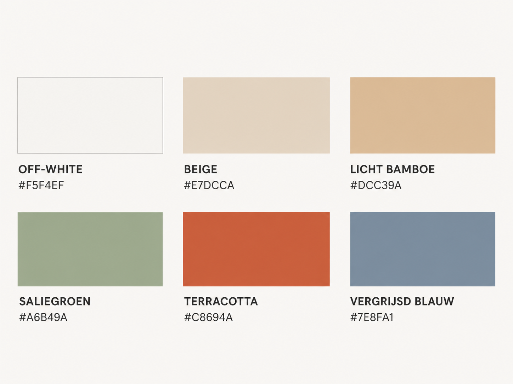
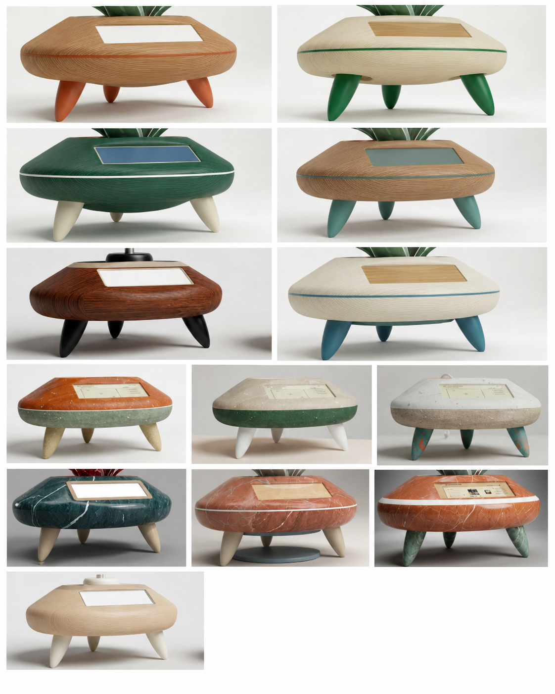

## Develop 3
In deze Develop 3-fase ligt de focus op de verdere verfijning van de gebruikerservaring, de emotionele beleving en de esthetische uitwerking van het product. Het concept werd eerder al functioneel gevalideerd, waardoor nu vooral onderzocht wordt hoe het product aanvoelt, welke emoties het oproept en hoe het past binnen een bredere servicecontext.

Daarom wordt in dit verslag aandacht besteed aan UX, Service Design en CMF. De kleuren, materialen en afwerkingen worden geanalyseerd en vertaald naar verschillende prototypevarianten. Deze varianten worden vervolgens getest bij gebruikers om de finale ontwerpkeuzes te onderbouwen en het product zowel functioneel als emotioneel sterker te maken.
## STAP 1 DEELOPDRACHT 5 NOG MAKEN

### <ins>**CMF analyse**</ins>
In de CMF analyse worden bepaalde CMF opties gekozen en onderbouwd om later bij gebruikerstesten de definitieve CMF te valideren. De werkwijze is gebasseerd op de workshop CMF van de les. 

**doelgroep in kernwoorden**

  

mindmap CMF

**product in omgeving**

  
  
    

meubels omgeving

**CMF analyse omgeving**

 Overlappende CMF analyse producten: warm minimal natural 

 

Over alle drie de producten is een duidelijke samenhang zichtbaar in kleur, materiaal, afwerking en vormgeving. 

 

Kleur 
De gebruikte kleuren zijn neutraal, licht en warm. Tinten zoals wit, beige en zand domineren, telkens met een warme ondertoon. Er worden geen uitgesproken kleuren of sterke contrasten toegepast. Dit zorgt voor een rustige, toegankelijke en tijdloze uitstraling. 

Materialen 
Er is een combinatie van natuurlijke en industriële materialen. Natuurlijke elementen zoals hout en rotan worden gecombineerd met materialen zoals MDF en polyester stoffen. De natuurlijke materialen zijn zichtbaar en tactiel aanwezig, maar blijven beperkt in kost. Dit resulteert in een benadering die kan worden omschreven als betaalbare natuur, eerder dan puur premium of volledig synthetisch. 

Afwerking 
De afwerking is consequent mat, zacht en tactiel, zonder reflecterende oppervlakken. Hoogglans en uitgesproken texturen worden vermeden. Dit leidt tot een lage visuele prikkel en een verhoogde perceptie van comfort.  

**overeenkomst CMF en doelgroep**

De drie CMF’s sluiten sterk aan bij de beschreven doelgroep van energiebewuste gezinnen. De nadruk op zachte, warme kleuren en natuurlijke materialen ondersteunt waarden zoals comfort, rust en zachtheid. De eenvoudige, tijdloze vormgeving en het gebruik van neutrale tinten dragen bij aan een gevoel van duurzaamheid en lange levensduur, wat aansluit bij het idee van kwaliteit en tijdloosheid. Daarnaast zijn de producten visueel discreet, wat goed past bij “discreet in rustmodus”. 

**standaard in de markt**

Binnen deze markt is er een duidelijke standaardtaal zichtbaar. Die bestaat uit lichte houttinten in combinatie met wit of beige, matte afwerkingen en een algemene voorkeur voor neutrale, warme kleuren. Materialen ogen natuurlijk, maar zijn vaak industrieel geproduceerd. De vormgeving is eenvoudig, functioneel en zonder uitgesproken details. Deze aanpak zorgt voor brede toepasbaarheid en toegankelijkheid, maar leidt ook tot een zekere uniformiteit tussen producten en merken. Het resultaat is een herkenbare Scandinavisch geïnspireerde stijl die inmiddels sterk genormaliseerd is. 

**oppurtiniteit voor differentiatie**

Op vlak van kleurgebruik ligt er een duidelijke kans om het huidige neutrale palet subtiel uit te breiden. In plaats van uitsluitend wit, beige en licht hout kunnen gedempte accentkleuren zoals saliegroen, terracotta of vergrijsd blauw worden ingezet. Deze kleuren blijven rustig en harmonieus, maar geven producten meer identiteit en onderscheiden ze van het standaardaanbod. 

  

kleurenpallet

 

Ook op het niveau van materiaalgebruik is er ruimte voor meer authenticiteit. Waar vandaag vaak gewerkt wordt met industriële materialen met een natuurlijke uitstraling, kan men sterker inzetten op het zichtbaar maken van echte materialen. Het gebruik van massief hout in plaats van fineer, grover geweven stoffen met een duidelijke textuur, of combinaties met materialen zoals keramiek of natuursteen zorgen voor een rijkere en meer geloofwaardige uitstraling. Hierdoor stijgt niet alleen de visuele kwaliteit, maar ook de tactiele beleving van het product. 

Wat betreft afwerking kan differentiatie ontstaan door subtiele contrasten en verfijnde details toe te voegen. In plaats van volledig uniforme, matte oppervlakken kan gewerkt worden met combinaties van matte en licht satijnen afwerkingen of met variaties in textuur. Daarnaast kunnen zichtbare verbindingen, zorgvuldig afgewerkte randen of kleine constructieve details bijdragen aan een meer gelaagde en verfijnde uitstraling. Deze ingrepen blijven discreet, maar maken het product visueel interessanter. 

**CMF varianten**

Op basis van deze kennis werden de volgende varianten gemaakt die we later konden testen bij de gebruikers.

  

CMF varianten

### <ins>**Build & test**</ins>
**Doelstellingen**

Het doel van deze test is om verschillende prototypevarianten met elkaar te vergelijken en zo de finale ontwerpkeuzes te onderbouwen. Daarbij wordt onderzocht welke variant het best aansluit bij de noden en verwachtingen van de doelgroep op vlak van uitstraling, kleur, materiaal, afwerking en emotionele impact.
**Materialen**

* Touch and feel bord 
* Smartphone voor opnames/foto’s 
* Informed consent
* Renders 

**Methoden**

De testen werden afgenomen bij vijf respondenten met uiteenlopende leeftijden en verschillende niveaus van technologische ervaring. Deze brede selectie werd gekozen omdat EcoLux bedoeld is voor een diverse doelgroep. De interviews vonden plaats in de thuisomgeving van de respondenten, zodat het product en de varianten konden worden beoordeeld binnen een realistische gebruikscontext.

Tijdens de test kregen de deelnemers verschillende renders en een touch-and-feel bord te zien. Aan de hand daarvan werden voorkeuren rond kleur, textuur, materiaal en afwerking onderzocht. De respondenten vergeleken onder andere matte en glanzende afwerkingen, gladde en getextureerde oppervlakken, en hout tegenover kunststof. Daarnaast werd gevraagd waar ze het product in hun woning zouden plaatsen, of het mocht opvallen of net moest opgaan in het interieur, en welke emoties EcoLux idealiter zou moeten oproepen.

De data werd verzameld via een semigestructureerd interview, waarbij ruimte was voor gerichte vragen én spontane feedback. Nadien werden de resultaten geanalyseerd om terugkerende patronen in voorkeuren, attitudes en motivaties te herkennen. Deze inzichten vormden de basis voor de verdere verfijning van de CMF-keuzes en werden vertaald naar ontwerpimplicaties en finale design requirements.
**Resultaten**
