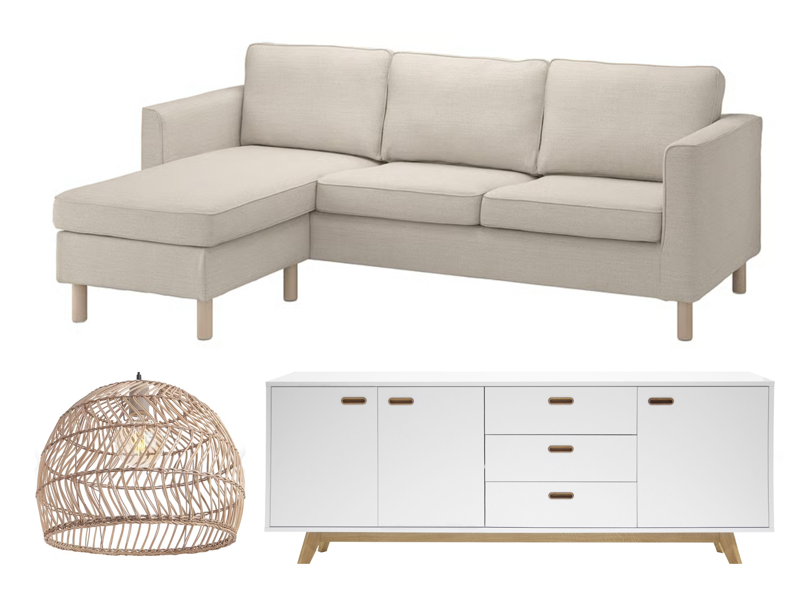

## Develop 3
In deze Develop 3-fase ligt de focus op de verdere verfijning van gebruikerservaring, emotionele beleving en esthetische uitwerking. Het concept werd eerder functioneel gevalideerd. Daarom wordt nu onderzocht hoe het product aanvoelt, welke emoties het oproept en hoe het past binnen een bredere servicecontext.

In dit verslag wordt aandacht besteed aan UX, Service Design en CMF. Kleuren, materialen en afwerkingen worden geanalyseerd.

### <ins>**Service Design**</ins>

### EcoLux — Customer Journey

<table>
<tr>
<td width="11%" valign="top">

## 1. Awareness

### Goal
Grip krijgen op energieverbruik en energieverlies verminderen.

### Actions
- Hoort over EcoLux via advertenties, sociale media of mond-tot-mondreclame.
- Realiseert hoeveel energie verloren gaat in huis.

### Touchpoints
- Website
- Social media
- Advertenties
- Energie-artikels
- Demo’s

### Emoties
Frustratie  
Hoop

### Pain Points
- Geen inzicht in energieverlies.
- Smart-home systemen lijken technisch of duur.

### Opportuniteiten
- Duidelijke communicatie rond besparing.
- Focus op eenvoud en toegankelijkheid.

### Backstage / Stakeholders
- Marketingteam
- Energie-data
- Online platform
- Energiepartners

</td>

<td width="11%" valign="top">

## 2. Consideration

### Goal
Begrijpen of EcoLux relevant is voor de woning.

### Actions
- Vergelijkt EcoLux met andere oplossingen.
- Bekijkt demo’s en scenario’s.
- Probeert automatisatie te begrijpen.

### Touchpoints
- Website
- Reviews
- Demo video’s
- Prototype presentatie

### Emoties
Nieuwsgierigheid  
Onzekerheid

### Pain Points
- Moeilijk inschatten welke componenten nodig zijn.
- Angst voor complexe installatie.

### Opportuniteiten
- Scenario’s visueel tonen.
- Concrete situaties demonstreren.

### Backstage / Stakeholders
- Product positioning
- Pricing
- Klantendienst
- Retailpartners

</td>

<td width="11%" valign="top">

## 3. Onboarding

### Goal
EcoLux correct installeren en verbinden.

### Actions
- Plaatst sensoren en actuatoren.
- Verbindt hoofdstation met app.
- Test eerste functies.

### Touchpoints
- Hoofdstation
- Substations
- App
- Packaging
- Handleiding

### Emoties
Onzekerheid  
Opluchting  
Wow-moment

### Pain Points
- Onduidelijke plaatsing.
- Connectiviteitsproblemen.

### Opportuniteiten
- Guided setup.
- Duidelijke feedback via LEDs.

### Backstage / Stakeholders
- Connectivity systems
- Cloud services
- Installatie support

</td>

<td width="11%" valign="top">

## 4. Use

### Goal
Inzicht krijgen in energieverlies.

### Actions
- Ontvangt meldingen.
- Ziet energieverlies in realtime.
- Reageert op feedback.

### Touchpoints
- LEDs
- Display
- Sensor feedback

### Emoties
Verrassing  
Inzicht

### Pain Points
- Te veel meldingen.
- Onduidelijke oorzaak van verlies.

### Opportuniteiten
- Contextuele meldingen.
- Prioriteren van notificaties.

### Backstage / Stakeholders
- Sensor data processing
- Realtime monitoring
- Energie-algoritmes

</td>
</tr>
</table>

<table>
<tr>
<td width="11%" valign="top">

## 5. Decision

### Goal
Beslissen hoe te reageren.

### Actions
- Negeert melding.
- Gebruiker kiest ervoor om het probleem op te laten lossen.
- Laat EcoLux automatisch handelen.

### Touchpoints
- Display
- Interface
- Actuatoren

### Emoties
Controle  
Opluchting

### Pain Points
- Te veel keuzes.

### Opportuniteiten
- Snelle acties.
- Eenvoudige interacties.

### Backstage / Stakeholders
- AI aanbevelingen
- Beslissingslogica
- Sensor-actuator communicatie

</td>

<td width="11%" valign="top">

## 6. Automation

### Goal
Automatisch energiebeheer.

### Actions
- EcoLux schakelt verlichting of toestellen uit.

### Touchpoints
- Actuatoren
- Statusfeedback

### Emoties
Vertrouwen  
Mogelijke irritatie

### Pain Points
- Angst voor verlies van controle.
- Onverwachte acties.

### Opportuniteiten
- Transparantie bieden.
- Override mogelijkheid.

### Backstage / Stakeholders
- AI learning
- Automatiseringsregels
- Software updates

</td>

<td width="11%" valign="top">

## 7. Integration

### Goal
EcoLux integreren in dagelijkse routines.

### Actions
- Gebruikt slaapmodus.
- Activeert “huis verlaten”-modus.

### Touchpoints
- Fysieke schakelaar
- Interface

### Emoties
Rust  
Veiligheid

### Pain Points
- Vergeten functies te gebruiken.

### Opportuniteiten
- Gedragsgebaseerde automatisatie.

### Backstage / Stakeholders
- Scenario management
- Smart-home integraties
- Gedragsanalyse

</td>

<td width="11%" valign="top">

## 8. Feedback

### Goal
Resultaten begrijpen en opvolgen.

### Actions
- Bekijkt rapporten.
- Analyseert besparing.
- Evalueert gebruiksgemak.

### Touchpoints
- Dashboard
- Rapporten
- Statistieken

### Emoties
Trots  
Motivatie

### Pain Points
- Data te technisch.

### Opportuniteiten
- Simpele visualisaties.
- Heldere rapportering.

### Backstage / Stakeholders
- Data-analyse
- Rapportgeneratie
- Cloud opslag

</td>

<td width="11%" valign="top">

## 9. Loyalty

### Goal
Langdurig gebruik en uitbreiding.

### Actions
- Beveelt EcoLux aan.
- Breidt systeem uit.
- Verwacht updates en support.

### Touchpoints
- Community
- Support
- Add-ons
- Updates

### Emoties
Loyaliteit  
Vertrouwen

### Pain Points
- Minder engagement op lange termijn.

### Opportuniteiten
- Uitbreidbaar ecosysteem.
- Communitygevoel versterken.

### Backstage / Stakeholders
- Customer support
- Software updates
- Hardware partners

</td>
</tr>
</table>

### <ins>**CMF analyse**</ins>

In de CMF analyse worden CMF opties gekozen en onderbouwd om later bij gebruikerstesten de definitieve CMF te valideren. De werkwijze is gebaseerd op de workshop CMF van de les. 

**doelgroep in kernwoorden**

  

mindmap CMF

**product in omgeving**

  

meubels omgeving

### **CMF analyse omgeving**

 Overlappende CMF analyse producten: warm minimal natural 

Over alle drie de producten is een duidelijke samenhang zichtbaar in kleur, materiaal, afwerking en vormgeving. 

**Kleur**:
De kleuren zijn neutraal, licht en warm. Wit, beige en zand domineren, telkens met een warme ondertoon. Er zijn geen uitgesproken kleuren of sterke contrasten. Dit zorgt voor een rustige, toegankelijke en tijdloze uitstraling. 

**Materialen**:
Er is een combinatie van natuurlijke en industriële materialen. Hout en rotan worden gecombineerd met MDF en polyester stoffen. De natuurlijke materialen zijn zichtbaar en tactiel aanwezig, maar blijven betaalbaar. Dit voelt als betaalbare natuur, eerder dan puur premium of volledig synthetisch. 

**Afwerking**:
De afwerking is mat, zacht en tactiel. Reflecterende oppervlakken en hoogglans worden vermeden. Daardoor ontstaat een lage visuele prikkel en een hoger gevoel van comfort.  

### **Overeenkomst CMF en doelgroep**

De drie CMF’s sluiten sterk aan bij energiebewuste gezinnen. Zachte kleuren en natuurlijke materialen ondersteunen comfort, rust en zachtheid. De eenvoudige vormgeving en neutrale tinten geven een gevoel van duurzaamheid en lange levensduur. De producten zijn ook visueel discreet, wat past bij “discreet in rustmodus”. 

### **Standaard in de markt**

Binnen deze markt is een duidelijke standaardtaal zichtbaar: lichte houttinten met wit of beige, matte afwerkingen en warme neutrale kleuren. Materialen ogen natuurlijk, maar zijn vaak industrieel geproduceerd. De vormgeving is eenvoudig en functioneel. Dit zorgt voor brede toepasbaarheid, maar ook voor uniformiteit. 

### **Opportinuteit voor differentiatie**

Er ligt een kans om het neutrale palet subtiel uit te breiden. Gedempte accentkleuren zoals saliegroen, terracotta of vergrijsd blauw blijven rustig, maar geven het product meer identiteit. 

  

kleurenpalet

Ook materiaalgebruik kan authentieker. In plaats van industriële materialen met een natuurlijke uitstraling kan sterker worden ingezet op echte materialen. Massief hout, grover geweven stoffen, keramiek of natuursteen zorgen voor meer visuele kwaliteit en tactiele beleving. 

Bij afwerking kan differentiatie ontstaan door subtiele contrasten en details, zoals mat met licht satijn, textuurvariaties of afgewerkte randen. Deze ingrepen blijven discreet, maar maken het product interessanter.

**morfologische matrix**

  

CMF morfologische matrix

**CMF varianten**

Op basis van de morfologische matrix werden de volgende varianten gemaakt die we later konden voorstellen aan de gebruikers.

  

CMF varianten

### <ins>**Build & test**</ins>
**Doelstellingen**

Het doel van deze test was om verschillende prototypevarianten te vergelijken en finale ontwerpkeuzes te onderbouwen. Er werd onderzocht welke variant het best aansluit bij de doelgroep op vlak van uitstraling, kleur, materiaal, afwerking en emotionele impact.

**Materialen**

* Touch and feel bord 
* Smartphone voor opnames/foto’s 
* Informed consent
* Renders 

  

touch and feel bord

**Methoden**

De testen werden afgenomen bij vier respondenten met verschillende leeftijden en niveaus van technologische ervaring. De interviews vonden plaats in de thuisomgeving, zodat het product realistisch beoordeeld kon worden.

Tijdens de test kregen deelnemers renders en een touch-and-feel bord te zien. Hiermee werden voorkeuren rond kleur, textuur, materiaal en afwerking onderzocht. Respondenten vergeleken matte en glanzende afwerkingen, gladde en getextureerde oppervlakken, en hout tegenover kunststof. Ook werd gevraagd waar ze het product zouden plaatsen en welke emoties EcoLux moest oproepen.

De data werd verzameld via een semigestructureerd interview met ruimte voor gerichte vragen en spontane feedback. Nadien werden terugkerende patronen in voorkeuren, attitudes en motivaties geanalyseerd. Deze inzichten vormden de basis voor verdere CMF-keuzes en design requirements.

**Resultaten**

  

interactie gebruikerstest

Uit de interviews kwamen inzichten naar voren over uitstraling, materiaal, kleur en gebruikscontext. Respondenten willen dat het product subtiel aanwezig is in het interieur. Het mag aantrekkelijk zijn, maar niet te sterk opvallen of technisch aanvoelen. Een rustige vormgeving die past binnen verschillende woonstijlen is daarom belangrijk.

Gebruikers hechten veel belang aan kwaliteit, degelijkheid en betrouwbaarheid. Het product moet vertrouwen opwekken en mag niet goedkoop ogen. Natuurlijke materialen of materialen met een natuurlijke uitstraling werden positief beoordeeld. Hout of een houtachtige afwerking past goed bij het duurzame karakter van EcoLux.

Op vlak van kleur verkiezen respondenten zachte, lichte en natuurlijke tinten. Deze zijn toegankelijker en minder storend in een woning. Het product moet rustig ogen, maar wel eigenheid hebben.

Qua textuur waarderen gebruikers vooral subtiele visuele textuur. Een natuurlijke nerf of fijne afwerking maakt het product warmer en kwalitatiever. Sterk voelbare of ruwe textuur werd minder positief ervaren. Een gladde of matte afwerking sluit beter aan bij dagelijks gebruik.

Algemeen beoordelen respondenten het product niet alleen op functionaliteit, maar ook op emotionele en esthetische beleving. De vormgeving moet vertrouwen en rust uitstralen.

### <ins>Conclusies en implicaties</ins>
De Develop 3-fase toont dat EcoLux verder moet evolueren van functioneel concept naar een product dat ook sterk scoort op gebruikservaring, uitstraling en emotionele beleving.

Uit de customer journey blijkt dat gebruikers nood hebben aan eenvoud, duidelijke feedback en vertrouwen. Smart-homeproducten kunnen snel technisch of complex aanvoelen. EcoLux moet zich daarom onderscheiden als toegankelijke oplossing. Tijdens installatie, dagelijks gebruik en automatisatie moet de gebruiker begrijpen wat het systeem doet en controle behouden.

De CMF-analyse en gebruikerstesten wijzen in dezelfde richting. Respondenten verkiezen een product dat subtiel aanwezig is en betrouwbaar oogt. Zachte, lichte en natuurlijke tinten, matte afwerkingen en hout of een houtachtige uitstraling sluiten het best aan bij rust, duurzaamheid en huiselijkheid.

De belangrijkste implicatie is dat EcoLux moet worden uitgewerkt als warm, discreet en gebruiksvriendelijk interieurproduct. De vormgeving moet eenvoudig blijven, maar mag subtiele details of accentkleuren bevatten. Feedback, meldingen en automatisatie moeten helder en controleerbaar blijven, zodat het product vertrouwen opwekt en deel wordt van dagelijkse routines.
Op basis hiervan werden de design requirements aangevuld.