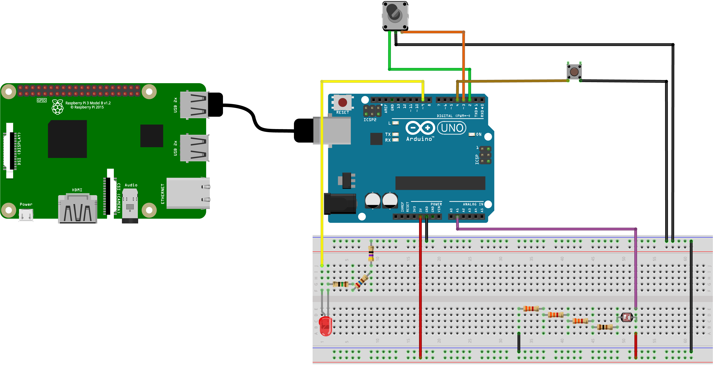

## Develop 4
In deze fase ligt de focus op de software en hardware van de EcoLux.
De bedoeling van deze fase is om de functionaliteit van de EcoLux te valideren. 

## Inleiding
Het systeem bestaat uit vier onderdelen die samenwerken: het aanraakscherm, de achterliggende software, de verbinding met slimme apparaten, en het fysieke waarschuwingslampje.

## Systeemarchitectuur

De vier onderdelen communiceren continu met elkaar:

| Onderdeel | Wat het doet | Hoe het communiceert |
|---|---|---|
| Aanraakscherm | Toont de plattegrond en apparaten | Stuurt verzoeken naar de software |
| Achterliggende software die draait op de Raspberry pi| Verwerkt alle informatie en onthoudt de staat | Stuurt opdrachten naar apparaten en lampje |
| Apparaatverbinding via Raspberry pi | Praat met slimme apparaten (lampen, stekkers...) | Via het Matter-protocol over het thuisnetwerk |
| Arduino + LED + Rotary Encoder + Lichtsensor | Fysieke indicator bij energieproblemen | Verbonden via USB-kabel met de Raspberry Pi |

## Verbinding met slimme apparaten (Matter)

EcoLux gebruikt **Matter**, een open standaard die werkt met slimme apparaten van veel verschillende merken. Een apart programma op de Raspberry Pi beheert alle gekoppelde apparaten en zorgt dat opdrachten (zoals "zet lamp uit") worden doorgegeven.

### Een nieuw apparaat koppelen

Wanneer je een nieuw slim apparaat wil toevoegen, doorloopt het systeem vier stappen:

1. Het apparaat maakt zichzelf bekend op het netwerk
2. Er wordt een beveiligde verbinding opgezet via een code
3. Na verificatie krijgt het apparaat toestemming om deel uit te maken van jouw netwerk
4. Vanaf dan verloopt alle communicatie via een beveiligd certificaat

## Achterliggende software

De achterliggende software is het brein van EcoLux. Het ontvangt vragen van het aanraakscherm, haalt informatie op bij de apparaten, en stuurt opdrachten terug. Het draait onzichtbaar op de achtergrond op de Raspberry Pi.

### Hoe wordt bijgehouden hoe lang iets aanstaat?

Elke keer dat het scherm de apparatenlijst opvraagt, vergelijkt de software of een apparaat net is aangedraaid. Als dat zo is, slaat het de huidige tijd op. Zo weet het scherm later precies hoe lang het apparaat al aanstaat.

### Beschikbare acties

| Actie | Wat er gebeurt |
|---|---|
| Apparatenlijst opvragen | Alle apparaten worden opgehaald, inclusief plaatsing en instellingen |
| Apparaat aan/uit/wisselen | Een opdracht wordt verstuurd naar het slimme apparaat |
| Plaatsing opslaan | Kamer en positie worden bewaard |
| Tijdsdrempel instellen | Instelling voor hoe lang een apparaat aan mag staan wordt opgeslagen |
| Nieuw apparaat koppelen | Apparaat wordt toegevoegd via een koppelcode |

## Aanraakscherm

Het aanraakscherm toont een overzicht van je huis en is speciaal ontworpen voor bediening met de vinger.

### Wat zie je?

1. **Plattegrondoverzicht** — alle kamers van je huis, aanklikbaar
2. **Kamerdetail** — de apparaten in een specifieke kamer, met de mogelijkheid ze te bedienen

### Wanneer wordt een kamer rood?

Het systeem berekent voortdurend hoe lang elk apparaat al aanstaat. Als dat langer is dan de ingestelde tijdsdrempel, kleurt de kamer rood op de plattegrond. De apparatenlijst wordt elke 5 seconden bijgewerkt.

### Een apparaat in een kamer plaatsen

Als je aangeeft waar een apparaat staat in de kamer, werkt dat als volgt:

1. Je kiest een kamer via een mini-plattegrond in het instellingenpaneel
2. De app navigeert automatisch naar die kamer
3. Er verschijnt een plaatsmodus: je cursor wordt een kruisje en bestaande apparaten worden iets vervaagd
4. Je klikt op de gewenste plek in de kamer
5. Na bevestiging wordt de positie opgeslagen

## Fysiek waarschuwingslampje (Arduino)

Naast het scherm is er een los lampje (in de realiteit zou dit een led strip zijn) dat oplicht wanneer er een energieprobleem is. Dit lampje is aangesloten op een kleine microcontroller (Arduino Uno) die via een USB-kabel verbonden is met de Raspberry Pi.

Het lampje past zijn helderheid automatisch aan op basis van het omgevingslicht, door middel van de lichtsensor, zodat het zowel overdag als 's avonds goed zichtbaar is. Met een draaiknop kan je de helderheid ook handmatig bijstellen. Omdat deze sensoren een analoog signaal leveren, was er nood aan een arduino, omdat deze over een ADC chip beschikt.

### Onderdelen

| Onderdeel | Aansluiting | Functie |
|---|---|---|
| Lichtsensor (LDR) | Analoge ingang | Meet hoe licht of donker het is in de ruimte |
| Draaiknop (encoder) | Digitale ingang | Handmatige fijnregeling van de helderheid |
| LED-lampje | PWM-uitgang | Knippert of brandt bij een energieprobleem |
| Weerstanden | Tussen componenten en arduino | Stroom beperken om componenten niet te beschadigen|
| Breadboard | / | Plaats om alle componenten te verbinden |
| Raspberry pi 3b+ | /| Hierop draaien al de programmas, dit is dus de centrale hub |
| Arduino UNO | / | Verbindingspunt Raspberry pi en fysieke componenten (ADC) |

  
  Opstelling

### Communicatie tussen Arduino en Raspberry Pi

De Arduino stuurt elke tiende van een seconde een klein berichtje naar de Pi met de huidige sensorwaarden en of het lampje aan of uit is. De Pi kan ook commando's terugsturen.

## Energiebewaking op de achtergrond

Naast de achterliggende software draait er nog een tweede programma op de Pi. Elke 10 seconden (ter illustratie) bekijkt dit programma alle apparaten die aanstaan. Als een apparaat de ingestelde tijdslimiet overschrijdt, stuurt het een waarschuwing naar de Arduino zodat het lampje gaat branden. Zodra het probleem opgelost is, wordt de waarschuwing automatisch uitgeschakeld.

## Wat gebeurt er stap voor stap bij een energieprobleem?

| Stap | Wat er gebeurt |
|---|---|
| 1 | Een apparaat gaat aan → de software onthoudt het tijdstip |
| 2 | Elke 10 seconden wordt gecontroleerd hoe lang apparaten al aanstaan |
| 3 | Een apparaat staat langer aan dan de ingestelde limiet |
| 4 | De software stuurt een waarschuwing naar het Arduino-lampje |
| 5 | Het LED-lampje gaat branden (helderheid afgestemd op de ruimte / rotary encoder) |
| 6 | Op het scherm kleurt de kamer rood |
| 7 | De gebruiker klikt op het apparaat en bevestigt dat het uit mag |
| 8 | Het apparaat wordt uitgeschakeld via het slimme netwerk |
| 9 | De software wist het tijdstip en stuurt een sein dat alles in orde is |
| 10 | Het LED-lampje gaat uit |

## Finale code en BOM
De finale code staat in de [Source](https://github.com/Vic-Syryn/EcoLux/tree/main/src).

De finale benodigheden staat in de [BOM](./bom.md)

## Behuizing
Rond deze hardware moet er natuurlijk behuizing zijn om de EcoLux te vormen. De vorm is gebasseerd op de gebruikerstesten van develop 2. 

  
  CAD bestand

Dit 3D model werd dan 3D geprint. In realiteit was het model te groot voor de 3D printer die we ter beschikking hadden en werd het model op gesplitst, zie BOM

  
  3D print onderdeel

  
  Ecolux

