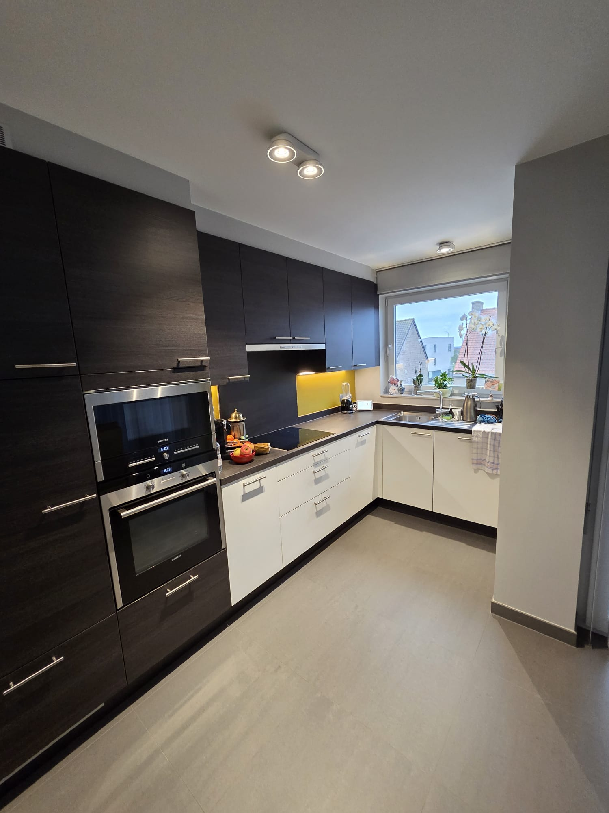
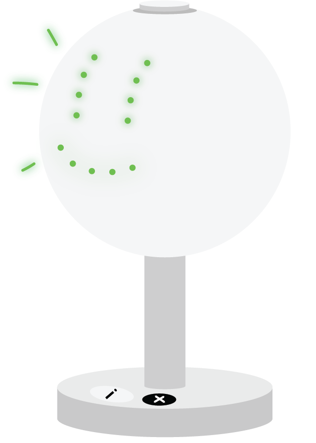

## Discovery

De discoveryfase had als doel inzicht te verwerven in waarom huishoudens, ondanks een duidelijke bereidheid om te besparen, in de praktijk moeite hebben om hun energieverbruik effectief te verminderen. De focus lag hierbij niet op technische optimalisatie, maar op gedrag, routines en perceptie: waar ontstaat energieverspilling en waarom blijft deze vaak onopgemerkt? De inzichten uit deze fase vormden de basis voor het definiëren van onderbouwde designbeslissingen en productvereisten.

### Doelstellingen

De hoofddoelstelling was het doorgronden van de kloof tussen de intentie om te besparen en het daadwerkelijke dagelijkse gedrag.

Welke deelvragen moesten hiervoor beantwoord worden?
De volgende deelvragen stonden centraal:

* Hoe ervaren gebruikers hun dagelijks energieverbruik? 

* Welke momenten in de dagelijkse routine leiden tot energieverspilling? 

* Welke motivaties en barrières spelen een rol bij besparen? 

* Hoe worden bestaande slimme oplossingen ervaren? 

* Welke vorm van feedback ondersteunt gedragsverandering zonder extra cognitieve belasting? 

### Materiaal & methoden

Om zowel de probleemruimte als de oplossingsruimte te verkennen, werden twee complementaire onderzoeksmethoden toegepast: contextual inquiries en een benchmarkonderzoek.

**Contextual inquiries (gebruikersonderzoek)**
Er werden drie contextual inquiries uitgevoerd bij uiteenlopende huishoudens: een technologie-enthousiasteling, een gemiddelde gebruiker en een oudere alleenstaande. Deze methode werd gekozen omdat ze toelaat om gebruiksgedrag en context in de natuurlijke thuissituatie te observeren. Naast semigestructureerde interviews werden dagelijkse routines, toestellen en omgevingsfactoren in kaart gebracht. De dataverzameling bestond uit observatienotities, audio-opnames en foto’s. De verzamelde data werd thematisch geanalyseerd op terugkerende patronen in gedrag, motivatie, barrières en attitudes ten opzichte van slimme technologie. (Het volledige protocol en rapport zijn beschikbaar via de repository).

  

gebruikersonderzoek

**Benchmarkonderzoek (markt & technologie)**
Aanvullend werd een benchmarkonderzoek uitgevoerd naar bestaande slimme oplossingen voor energiebeheer. Het doel was om te analyseren hoe deze oplossingen feedback geven, welke interactievormen worden gebruikt en in welke mate ze gedrag ondersteunen. De analyse gebeurde aan de hand van een vergelijkende tabel en een thematische synthese.

### Resultaten

**Resultaten uit contextual inquiries**
Uit de interviews en observaties kwamen de volgende consistente patronen naar voren:

* Energieverbruik wordt zelden actief en continu opgevolgd; gebruikers vertrouwen vooral op intuïtie of sporadische checks.

* De motivatie om te besparen is voornamelijk financieel, terwijl ecologische voordelen als secundair worden ervaren.

* Sluipverbruik en ventilatie vormen belangrijke, maar moeilijk controleerbare bronnen van energieverlies.

* Slimme technologie is beschikbaar, maar wordt vaak als complex en tijdsintensief ervaren.

* Gebruiksgemak en comfort blijken doorslaggevend voor langdurig gebruik.

Deze bevindingen wijzen op een duidelijke kloof tussen beschikbare technologie en het dagelijkse gedrag van gebruikers.

### Afbakening van de doelgroep

Op basis van de interviews, contextual inquiries en het benchmarkonderzoek werd de doelgroep aangescherpt naar huishoudens die een woning renoveren. Deze gebruikers bevinden zich in een fase waarin bestaande routines worden herbekeken en beslissingen rond energie, comfort en technologie actief worden genomen. Zowel uit de interviews als uit externe bronnen blijkt dat energiebesparing tijdens renovaties voornamelijk wordt gemotiveerd door financiële redenen [^6], aangevuld met regelgeving en duurzaamheidsdoelstellingen [^7].

Daarnaast is een renovatie een geschikt instapmoment voor nieuwe producten, aangezien installatiedrempels lager liggen en gebruikers meer openstaan voor verandering. Gedragsinterventies blijken effectiever wanneer ze worden geïntroduceerd op zulke overgangsmomenten [^8]. Hierdoor werd deze doelgroep als meest relevant beschouwd voor het verdere ontwerpproces.

**Resultaten uit benchmarkonderzoek**
De vergelijking toont aan dat de markt sterk data-gedreven is, met een focus op cijfers, grafieken en apps. Intuïtieve of emotionele feedbackvormen zijn zeldzaam. De analyse maakt duidelijk dat ambient, niet-digitale feedback nauwelijks wordt toegepast, terwijl net deze vorm van feedback potentieel heeft om gedrag laagdrempelig te beïnvloeden.

| Nr. | Oplossing / merk                  | Type               | Kernfunctie                          | Sterkte                               | Beperking                                    |
| --- | --------------------------------- | ------------------ | ------------------------------------ | ------------------------------------- | -------------------------------------------- |
| 1   | **Google Nest Hub**[^1]           | Slim display       | Centrale bediening via scherm & stem | Veel integraties, gebruiksvriendelijk | Scherm- en appgericht, weinig gedragssturing |
| 2   | **tado° Smart Thermostat**[^2]    | Slimme thermostaat | Efficiënt verwarmen                  | Meetbare energiebesparing             | Enkel verwarming, beperkte feedback          |
| 3   | **NIKO Home Control**[^3]         | Domoticasysteem    | Volledige woningautomatisering       | Zeer krachtig en betrouwbaar          | Duur, hoge installatiedrempel                |
| 4   | **IKEA Dirigera**[^4]             | Budgetdomotica     | Basisautomatisering                  | Toegankelijk, lage kost               | Beperkte intelligentie, app-afhankelijk      |
| 5   | **Eve Energy**[^5]                | Slimme stekker     | Meten & schakelen van verbruik       | Inzicht per toestel                   | Geen centraal overzicht                      |
| 6   | **Netatmo Air Monitor**[^6]       | Klimaatsensor      | Inzicht in luchtkwaliteit            | Heldere feedback                      | Niet gericht op energiebesparing             |
| 7   | **Sense Energy Monitor**[^7]      | Energiemonitor     | Gedetailleerde verbruiksanalyse      | Zeer datagedreven                     | Complex, technisch                           |
| 8   | **AquaSave Shower Timer**[^8]     | Waterbesparing     | Nudging via tijd                     | Simpel en goedkoop                    | Geen integratie of context                   |
| 9   | **ecobee Thermostat**[^9]         | Slimme thermostaat | Comfort + energiebesparing           | Slimme AI-aansturing                  | Enkel temperatuur                            |
| 10  | **Energy Blossom (concept)**[^10] | Ambient feedback   | Emotionele nudging                   | Intuïtief, visueel                    | Conceptueel, niet commercieel                |

### Conclusies & implicaties

Op basis van de synthese van beide onderzoeksmethoden werden de volgende kerninzichten en bijbehorende designimplicaties geformuleerd:

| Observatie uit onderzoek                               | Inzicht                                    | Designimplicatie                               |
| ------------------------------------------------------ | ------------------------------------------ | ---------------------------------------------- |
| Gebruikers volgen hun energieverbruik zelden actief op | Energieverbruik is onzichtbaar en abstract | Feedback moet continu en passief aanwezig zijn |
| Apps en dashboards worden als complex ervaren          | Cognitieve belasting is te hoog            | Geen scherm of app als primaire interface      |
| Sluipverbruik en ventilatie blijven vaak onopgemerkt   | Verspilling gebeurt onbewust               | Automatische detectie is noodzakelijk          |
| Comfort primeert bij alle gebruikers                   | Besparen mag geen extra moeite kosten      | Oplossing moet comfort behouden of verhogen    |

Deze inzichten leidden tot de conclusie dat een effectief energiebesparend product energieverspilling automatisch dient te detecteren en dit op een eenvoudige, visuele en niet-invasieve manier moet communiceren. Daarbij moet het dagelijkse wooncomfort behouden of zelfs verhoogd worden. Op basis van deze inzichten werd een eerste mockup gemaakt.

  

1ste iteratie prototype

## Bronnen

[^1]:Google. (2025). Google Nest Hub (2nd Gen). Geraadpleegd op 9 oktober 2025, van https://store.google.com

[^2]: Tado°. (2025). Smart Thermostat – Intelligent heating control. Geraadpleegd op 9 oktober 2025, van https://www.tado.com

[^3]: NIKO. (2025). NIKO Home Control – Domotica voor woningen. Geraadpleegd op 9 oktober 2025, van https://www.niko.eu

[^4]: IKEA. (2025). Dirigera hub + Home Smart system. Geraadpleegd op 9 oktober 2025, van https://www.ikea.com

[^5]: Eve Systems. (2025). Eve Energy – Smart Plug & Power Meter. Geraadpleegd op 9 oktober 2025, van https://www.evehome.com

[^6]: Netatmo. (2025). Smart Indoor Air Quality Monitor. Geraadpleegd op 9 oktober 2025, van https://www.netatmo.com

[^7]: Sense Labs Inc. (2025). Sense Home Energy Monitor. Geraadpleegd op 9 oktober 2025, van https://sense.com

[^8]: AquaSave. (2025). AquaSave smart shower timer. Geraadpleegd op 9 oktober 2025, van https://www.aquasave.com

[^9]: Ecobee Inc. (2025). Ecobee Smart Thermostat Premium. Geraadpleegd op 9 oktober 2025, van https://www.ecobee.com

[^10]: DesignBoom. (2022, 14 mei). Energy Blossom: an ambient feedback concept for sustainable behavior. Geraadpleegd van https://www.designboom.com

