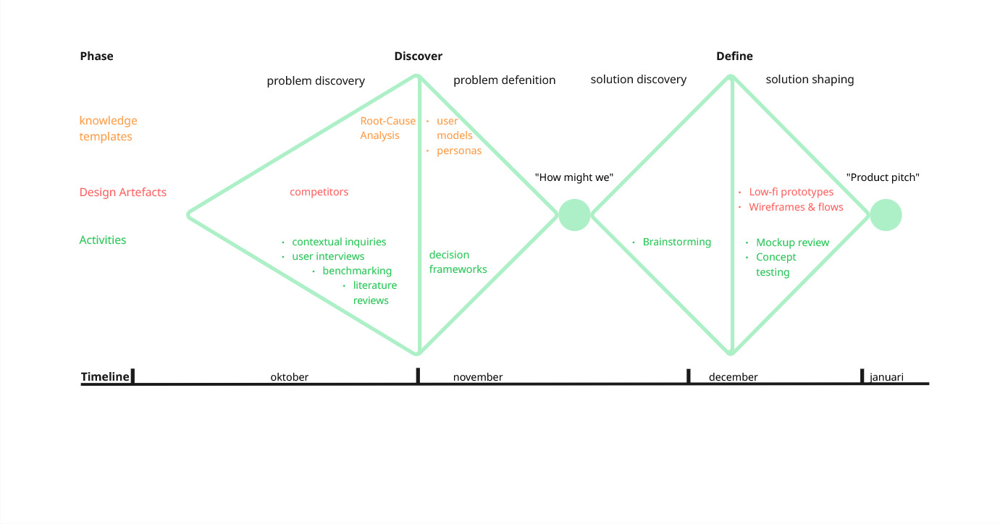

## Methodologie
*Max 400 woorden. Beschrijf je methodologie (enkel SEM1, zie les methodologie). Maak hierbij gebruik van een afbeelding om je tijdlijn weer te geven. Op deze tijdlijn moeten minimaal (1) een tijdsincatie te zien zijn (e.g. maanden of kwartalen), moeten fasen te zien (gekoppeld aan doelstellingen van die fase) zijn en moeten activiteiten te zien zijn (onderzoeksmethoden). Bekijk zeker ook eens [voorbeelden van eerdere jaren](https://github.com/basbaccarne/human-centered-design) (voor SEM1 betreft dit uiteraard slechts de helft van deze visualisaties). We boewen hier in het tweede semester op verder.*   

*Neem hier ook een tijdlijn in op waarin we de evoluties van de prototypes kunnen zien.*

  

Voor het onwerp process werd gebruik gemaakt van het triple diamond ontwerpmodel. Dit model bestaat uit 4 fasen, namelijk: discover, difine, develop en deliver.  
In het eerste semester werden de discover en define doorlopen.

<ins>**Discover fase**</ins>  
De discoveryfase richtte zich op het begrijpen van waarom huishoudens, ondanks een duidelijke bereidheid om energie te besparen, moeite hebben om dit gedrag structureel vol te houden. De focus lag op dagelijkse routines, perceptie en gebruikservaringen in plaats van op technische optimalisatie. Het doel was de kloof bloot te leggen tussen intentie en daadwerkelijk gedrag, en deze inzichten te vertalen naar onderbouwde designbeslissingen.

Via contextual inquiries bij drie verschillende huishoudtypes werd het energiegebruik in de natuurlijke context geobserveerd en besproken. Dit werd aangevuld met een benchmarkonderzoek naar bestaande slimme energieoplossingen. De resultaten tonen aan dat gebruikers hun energieverbruik zelden actief monitoren en vooral financieel gemotiveerd zijn om te besparen. Energieverspilling gebeurt vaak onbewust, met name door sluipverbruik en ventilatie. Hoewel slimme technologie beschikbaar is, wordt deze vaak als complex en belastend ervaren, waardoor langdurig gebruik uitblijft.

Het benchmarkonderzoek bevestigt dat de markt sterk data- en appgericht is, met weinig aandacht voor intuïtieve of ambient feedback die gedrag op een laagdrempelige manier kan beïnvloeden. Op basis van deze inzichten werd geconcludeerd dat een effectieve oplossing energieverspilling automatisch moet detecteren en deze continu, passief en visueel moet communiceren, zonder extra cognitieve belasting of verlies aan comfort. Deze conclusies vormen de basis voor de verdere conceptontwikkeling.

<ins>**Define fase**</ins>  
De define fase werd opgesplitst in twee waves:

**Wave 1** onderzocht hoe het energieprobleem kan worden gecommuniceerd en welke installatie- en functionaliteitsopties aansluiten bij gebruikersverwachtingen. Vier prototypes (emotie, vorm, licht en substations) werden getest via gebruikerstesten en interviews. Lichtsignalen bleken het duidelijkst en meest intuïtief. Emotionele en antropomorfe communicatie, zoals smileys en spraak, werd begrepen maar contextafhankelijk gewaardeerd: speels voor gezinnen, minder geschikt voor volwassen of zakelijke omgevingen. Personaliseerbaarheid verhoogde betrokkenheid, en negeerknoppen, handsfree bediening en substations verbeterden het gebruiksgemak. Installatie door een technieker werd geprefereerd, met een optie tot zelf installeren.

**Wave 2** richtte zich op de communicatie van energieverlies, automatisatie en de negeerfunctie. Via thinking-aloud- en question-asking-protocollen werden drie interfaces getest: spraak, tekst en grondplan. Spraak was duidelijk maar traag bij veel informatie, tekst snel scanbaar maar soms contextloos. De grondplanweergave gaf onmiddellijk inzicht in locatie van energieverlies en faciliteerde snelle actie. Gebruikers verwachtten dat EcoLux zoveel mogelijk automatisch ingrijpt, zonder uitgebreide instellingen. Visuele communicatie, snelheid en automatisatie bleken cruciale ontwerpprincipes voor verdere ontwikkeling.