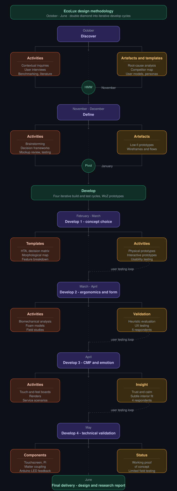

## Methodologie  

  

  triple diamond ontwerpmodel

Voor het ontwerpproces werd gebruikgemaakt van het triple diamond ontwerpmodel. Dit model bestaat uit vier fasen: discover, define, develop en deliver. In het eerste semester werden de discover- en definefase doorlopen. In het tweede semester lag de focus op de developfase waarin het concept iteratief werd uitgewerkt, getest en verfijnd.

<ins>**Discover fase**</ins>  
De discoveryfase richtte zich op het begrijpen waarom huishoudens, ondanks hun bereidheid om energie te besparen, dit gedrag moeilijk structureel volhouden. De focus lag op dagelijkse routines, perceptie en gebruikservaring, eerder dan op technische optimalisatie. Het doel was om de kloof tussen intentie en gedrag bloot te leggen en deze inzichten te vertalen naar onderbouwde ontwerpbeslissingen.

Via contextual inquiries bij drie verschillende huishoudtypes (N=3) werd energiegebruik in de natuurlijke wooncontext geobserveerd en besproken. Dit werd aangevuld met een benchmarkonderzoek naar bestaande slimme energieoplossingen. Hieruit bleek dat gebruikers hun energieverbruik zelden actief monitoren en vooral financieel gemotiveerd zijn om te besparen. Energieverspilling gebeurt vaak onbewust, onder meer door sluipverbruik, onnodig ingeschakelde toestellen en ventilatieverlies. Bestaande slimme oplossingen worden bovendien vaak als complex, technisch of belastend ervaren.

Het benchmarkonderzoek toonde aan dat de markt sterk data- en appgericht is, met weinig aandacht voor intuïtieve of ambient feedback. Daarom werd geconcludeerd dat een effectieve oplossing energieverlies automatisch moet detecteren en dit passief, visueel en begrijpelijk moet communiceren, zonder extra cognitieve belasting of verlies aan comfort.

<ins>**Define fase**</ins>  
De definefase werd opgesplitst in twee waves.

**Wave 1** onderzocht hoe het energieprobleem het best gecommuniceerd kan worden en welke installatie- en functionaliteitsopties aansluiten bij gebruikersverwachtingen. Hiervoor werden vier prototypes getest rond emotie, vorm, licht en substations via gebruikerstesten en interviews (N=3). Lichtsignalen bleken het duidelijkst en meest intuïtief. Emotionele communicatie, zoals smileys en spraak, werd begrepen maar was sterk contextafhankelijk: speels voor gezinnen, maar minder geschikt voor volwassen of zakelijke omgevingen. Personaliseerbaarheid, negeerknoppen, handsfree bediening en substations verhoogden het gebruiksgemak.

**Wave 2** richtte zich op de communicatie van energieverlies, automatisatie en de negeerfunctie. Via het Think Aloud Protocol en Question Asking Protocol werden drie interfaces getest (N=3): spraak, tekst en een grondplan. Spraak was duidelijk, maar traag bij veel informatie. Tekst was snel scanbaar, maar miste soms context. De grondplanweergave gaf onmiddellijk inzicht in de locatie van het energieverlies en maakte snelle actie mogelijk. Visuele communicatie, snelheid en automatisatie werden daarom belangrijke ontwerpprincipes.

<ins>**Develop fase**</ins>

Voor de developfase werd een pivot uitgevoerd. Uit interviews bleek dat binnen een gezin meestal één persoon actief bezig is met energiebewust gedrag. Daarom werd de doelgroep aangepast naar energiebewuste gezinnen die energieverspilling in hun huishouden willen vermijden en alle gezinsleden op een laagdrempelige manier willen betrekken.

De developfase werd opgesplitst in vier waves.

**Wave 1** richtte zich op het verder ontwikkelen van het concept en het testen van de basisinteractie. Via een scorematrix werd gekozen voor het concept van de slimme bloempot, omdat dit sterk scoorde op esthetiek, gebruiksgemak en aansluiting bij de ecologische positionering van EcoLux.

De interactie werd verder onderzocht via een customer journey, storyboards, productarchitectuur, userflows en een HTA. Hieruit bleek dat vooral de communicatie van energieverlies verder bepaald moest worden. Op basis daarvan werden de MVP-functionaliteiten gedefinieerd. Tijdens gebruikerstesten met een prototype van het hoofdstation (N=5) bleek dat een handmatig of automatisch uitschuifbaar scherm niet intuïtief genoeg was. Gebruikers gaven de voorkeur aan een stabiel object, duidelijke interactie en comfortabele kijkhoek. Daarom werd gekozen voor een vast geïntegreerd scherm.

**Wave 2** bouwde verder op deze eerste iteratie en focuste op vormgeving, schermgrootte en interface. Hiervoor werden meerdere fysieke prototypes ontwikkeld, waaronder verschillende vormvarianten en schermgroottes die modulair gecombineerd konden worden. De evaluatie gebeurde via gebruikerstesten in de thuiscontext van de deelnemers (N=5), zodat het gebruik in een realistische situatie kon worden geobserveerd.

Tijdens de testen gingen gebruikers in interactie met zowel de fysieke vorm als een digitale demoversie van de interface. Via TAP en QAP werden observaties gecombineerd met directe feedback. Er werd onderzocht hoe gebruikers de vormen ervaarden in hun interieur, hoe ze omgingen met verschillende schermgroottes en hoe intuïtief de interface werd begrepen. De kwalitatieve data werd geanalyseerd op terugkerende patronen en voorkeuren.

**Wave 3** richtte zich op gebruikerservaring, emotionele beleving en integratie in de woonomgeving. Eerst werd een customer journey opgesteld waarin het volledige gebruikstraject van EcoLux werd onderzocht, van bewustwording en installatie tot dagelijks gebruik en langdurige betrokkenheid. Hieruit bleek dat eenvoud, vertrouwen, transparantie en controle belangrijk blijven binnen smart-home automatisatie.

Daarnaast werd een CMF-analyse uitgevoerd. Op basis van referentieproducten, doelgroepanalyse en een morfologische matrix werden verschillende materiaal-, kleur- en afwerkingscombinaties ontwikkeld. Deze varianten werden getest via semigestructureerde interviews met vijf respondenten in hun thuisomgeving. Gebruikers kregen renders en een touch-and-feelbord te zien. De resultaten toonden een voorkeur voor zachte, natuurlijke kleuren, matte afwerkingen en warme materialen zoals hout of houtachtige texturen. Daarom werd gekozen voor een rustige, minimalistische vormtaal die subtiel aansluit bij het interieur.

**Wave 4** focuste op de technische uitwerking en validatie van EcoLux. In deze fase werd onderzocht of de kernfunctionaliteiten technisch haalbaar zijn. Het systeem werd opgebouwd rond vier onderdelen: het aanraakscherm, de software op een Raspberry Pi, de verbinding met slimme apparaten via Matter en een fysiek waarschuwingssysteem met Arduino en LED.

De Raspberry Pi fungeert als centrale hub en verwerkt informatie van de interface, slimme toestellen en het waarschuwingslampje. De software houdt bij welke apparaten gekoppeld zijn, waar ze zich bevinden en hoelang ze al ingeschakeld zijn. Wanneer een toestel langer aanstaat dan de ingestelde tijdsdrempel, kleurt de betrokken kamer rood op het scherm. Tegelijk stuurt de Raspberry Pi een signaal naar de Arduino, waardoor de LED oplicht als fysieke waarschuwing. De lichtsensor past de helderheid aan het omgevingslicht aan, terwijl de rotary encoder handmatige bijsturing mogelijk maakt.

Deze fase toonde aan dat de belangrijkste onderdelen van EcoLux technisch kunnen samenwerken. Het prototype kan apparaten opvolgen, waarschuwingen tonen en fysieke lichtfeedback activeren. Develop 4 vormde zo de stap van concept naar functioneel prototype.

De finale code van het prototype is terug te vinden in de [Source](https://github.com/Vic-Syryn/EcoLux/tree/main/src). De finale lijst met onderdelen is opgenomen in de [BOM](./bom.md).